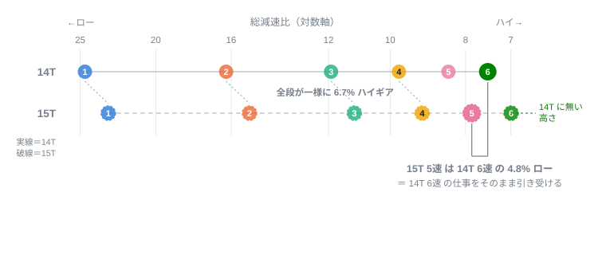
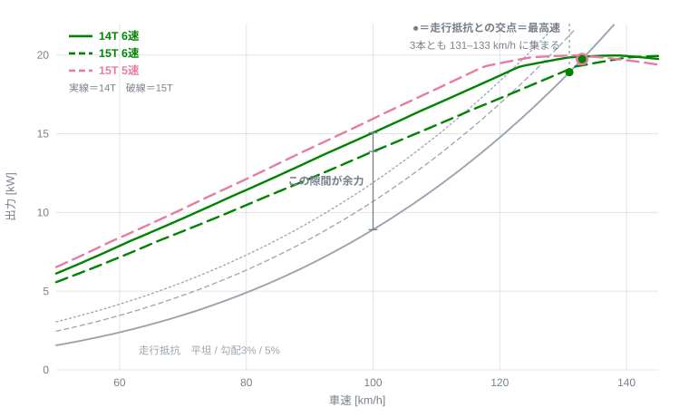
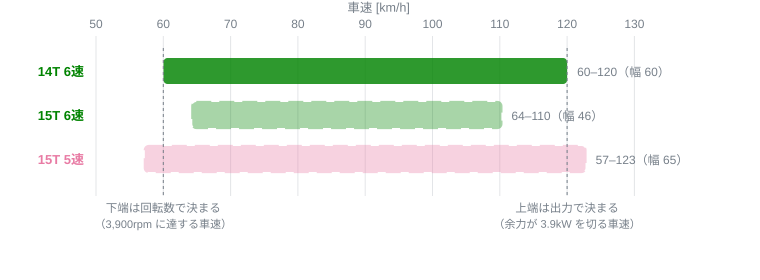
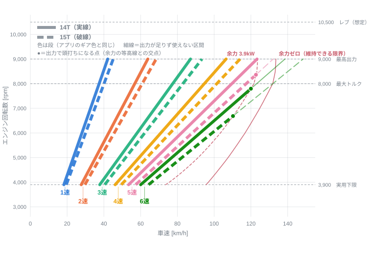

# フロントスプロケット 14T → 15T が走行余力に与える影響（CB250R / 2BK-MC52）

Honda CB250R（2018 年式 / 2BK-MC52）のフロントスプロケットを標準 14T から 15T へ変更した
ときに、各ギアの走行余力がどう変わるかを数値化する。「15T にすると 6 速で高速域のトルクが
足りない」という体感が物理的に裏付けられるか、高速道路の巡航が成立するかを判定することが
目的。結論としては体感は裏付けられるが、その正体は性能の低下ではなく**段の役割の再配置**
だった。

回転数と車速の関係は本リポジトリの実走ログで検証済み（[実測との突合](#実測との突合)）。
走行抵抗とエンジントルク曲線は仮定と推定を含む。区分は[前提](#前提)に明示する。

**扱う範囲**：6 速および 5 速の定常走行余力、6 速の実用車速範囲、向かい風耐性、最高速。
**扱わない範囲**：燃費、リアスプロケット変更（MC52 は 36T 固定）、チェーン長やクリアランス
などの装着上の可否、二人乗り・積載時、加速タイムそのもの。

## 結論

**従来 6 速が担っていた万能ギアとしての役割は 5 速へ移り、6 速は巡航専用のオーバードライブへ
逃がされた。** 15T 化で起きたのはこの役割の再配置であって、到達できる性能の低下ではない。

以下がその根拠。

1. **6 速の余力は全速度域で減る**。100 km/h で 6.2 → 5.0 kW（−19%）、120 km/h で
   3.9 → 2.5 kW（−37%）。速度が上がるほど差が開く。
2. **6 速 1 枚で走れる車速範囲が 60〜120 km/h から 64〜110 km/h へ縮む**（幅で 23% 減）。
   万能ギアではなくなった、というのはこの窓の縮小を指す。
3. **その役割は 5 速が引き取る**。15T の 5 速は 14T の 6 速より 4.8% ショートで、全速度域で
   余力が上回り、実用窓の上端も 123 km/h と 14T 6 速の 120 km/h を超える。
4. **最高速はほぼ変わらない**（133 → 132 km/h）。このクラスは出力律速であり、ギア比が
   届く届かないの問題ではない。
5. **逃がした先の 6 速は巡航として機能する**。100 km/h は余力 5.0 kW、勾配 8.3% 相当まで
   維持でき、回転は 6,497 → 6,064 rpm（−433 rpm）。120 km/h 区間も平坦・無風なら維持
   できるが余力は 14%（使用率 86%）で、加速の余地は残らない。

## 前提

### 年式による差異

2018 年式は **2BK-MC52**。2022 年 7 月のマイナーチェンジで **8BK-MC52** となり、出力・トルクの
**発生回転数が変わっている**。値そのもの（20 kW / 23 N·m）は同一。

| | 2BK-MC52（2018〜2022.6） | 8BK-MC52（2022.7〜） |
|---|---|---|
| 最高出力 | 20 kW［27 PS］/ **9,000 rpm** | 20 kW［27 PS］/ 9,500 rpm |
| 最大トルク | 23 N·m / **8,000 rpm** | 23 N·m / 7,750 rpm |
| 車両重量 | 144 kg | 144 kg |
| 変速比・減速比 | 同一 | 同一 |

**本書は 2BK-MC52 の諸元で計算している。** 8BK 系はトルクピークが 250 rpm 低く出力ピークが
500 rpm 高いため、6 速の余力は本書よりわずかに高速側へ寄る。傾向と結論は変わらない。

### 同定（諸元および実測で検証済み）

| 項目 | 値 | 出典 |
|---|---|---|
| 変速比 | 1速 3.416 / 2速 2.250 / 3速 1.650 / 4速 1.350 / 5速 1.166 / 6速 1.038 | 諸元 |
| 一次減速比 | 2.807 | 諸元 |
| 二次減速比（標準） | 2.571（= 36T / 14T） | 諸元 |
| スプロケット | 標準 前 14T / 後 36T（後は選択肢なし） | 諸元 |
| 車両重量 | 144 kg | 諸元 |
| 後輪タイヤ | 150/60R17 → 転動円周 1.9222 m | 諸元＋幾何計算 |
| 回転数と車速の関係 | 上式の計算値と実走ログが中央値 +0.6%（範囲 −0.3〜+2.8%）で一致 | 本リポジトリのログ |

### 推定

エンジントルク曲線。諸元 2 点（**20 kW / 9,000 rpm**、**23 N·m / 8,000 rpm**）に整合させた
補間形を用いる。実測ダイナモ値ではないため、絶対値には ±10% 程度の不確かさがある。
比較は 14T と 15T の差分で行うため、曲線全体が一様にずれても結論は変わらない。

### 仮定

| 記号 | 値 | 内容 |
|---|---|---|
| 乗員質量 | 75 kg | 乗員＋装備。走行質量は 144 + 75 = **219 kg** |
| CdA | 0.60 m² | 前面投影面積 × 抗力係数（直立ネイキッド＋乗員） |
| Crr | 0.020 | 転がり抵抗係数 |
| ρ | 1.20 kg/m³ | 空気密度 |
| 下端回転数 | 3,900 rpm | トップギアで粘れる下限とみなす値 |

CdA は結論への影響が大きいため[感度](#cda-感度)を示す。ただし CdA を変えても 14T と 15T の
**差**は約 1.2 kW で一定に保たれるため、順位は変わらない。

抗力モデルの妥当性は実測で部分的に確認できる。実走ログの 6 速定常で、実車速 57.5 → 92.5 km/h
に対し実効スロットル開度（全閉 10.2% を差し引いた値）は 9.4 → 19.2 ポイントで 2.04 倍。
同区間の必要トルク計算値は 2.1 倍。両者が一致するため、抗力の**速度依存の形**は合っている。
絶対値は較正されていない。

## 何が変わったか

丁数変更はラダー全体の一様なスケーリングであり、**段間比は一切変わらない**。

| 段 | 14T 総減速比 | 15T 総減速比 | 段間比 |
|---:|---:|---:|---:|
| 1 | 24.657 | 23.013 | 51.8% |
| 2 | 16.241 | 15.158 | 36.4% |
| 3 | 11.910 | 11.116 | 22.2% |
| 4 | 9.744 | 9.095 | 15.8% |
| 5 | 8.416 | **7.855** | 12.3% |
| 6 | **7.492** | 6.993 | — |

- 15T 6 速 / 14T 6 速 = 0.9333（**6.7% ハイギア**）
- 15T 5 速 / 14T 6 速 = 1.0484（**4.8% ローギア**）



対数軸なので、一様なスケーリングは全段が同じ距離だけ平行移動する形で現れる。15T の 5 速が
14T の 6 速のすぐ隣に落ち、15T の 6 速だけが 14T に存在しない高さへ出る。

一様な 6.7% の変更でありながら、効果は上の段に偏る。6.7% が段間比のどれだけを占めるかが
上下で違うため。

| | 段間比 | 6.7% が占める割合 |
|---|---:|---:|
| 5→6 速 | 12.3% | **0.54 段** |
| 1→2 速 | 51.8% | 0.13 段 |

上端では半段ぶん動くため役割が入れ替わり、下端では 1/8 段しか動かないため回転が下がる
だけに留まる。**5→6 の段差が全段中で最も詰まっている**ことが、丁数 1 枚でトップギアの
性格が変わる理由である。

## 走行余力

余裕 kW は「その車速を維持したうえで残る出力」、登坂% は「その余裕で登り続けられる勾配」、
使用率は「その回転数でエンジンが出せるトルクのうち定常走行に使っている割合」。



各段の曲線と走行抵抗曲線の**縦の隙間が余力**であり、**交差点が最高速**になる。15T 6 速
（橙）の曲線だけが下に位置するため隙間が狭く、しかも高速側ほど抵抗曲線が急に立ち上がるので
差が広がる。一方で 3 本の交差点は 131〜133 km/h に集まり、最高速がギア比でほとんど動かない
ことが読み取れる。

| 車速 | 14T 6速 rpm / 余裕 / 登坂 / 使用率 | 15T 6速 rpm / 余裕 / 登坂 / 使用率 | 15T 5速 rpm / 余裕 / 登坂 / 使用率 | 所要 |
|---:|---|---|---|---:|
| 60 | 3898 / 5.5 kW / 15.3% / 30% | 3638 / 4.8 / 13.3% / 33% | 4087 / **6.0** / 16.8% / 28% | 2.4 kW |
| 70 | 4548 / 6.1 / 14.7% / 36% | 4245 / 5.3 / 12.8% / 40% | 4768 / **6.8** / 16.2% / 34% | 3.5 |
| 80 | 5197 / 6.5 / 13.7% / 43% | 4851 / 5.6 / 11.7% / 47% | 5449 / **7.2** / 15.1% / 40% | 4.9 |
| 90 | 5847 / 6.6 / 12.2% / 51% | 5457 / 5.4 / 10.1% / 55% | 6130 / **7.4** / 13.7% / 48% | 6.7 |
| 100 | 6497 / 6.2 / 10.3% / 59% | 6064 / 5.0 / 8.3% / 64% | 6811 / **7.0** / 11.8% / 56% | 8.9 |
| 110 | 7147 / 5.3 / 8.1% / 69% | 6670 / 4.0 / 6.1% / 74% | 7493 / **6.3** / 9.5% / 65% | 11.6 |
| 120 | 7796 / 3.9 / 5.5% / 79% | 7276 / 2.5 / 3.5% / 86% | 8174 / **4.7** / 6.6% / 76% | 14.8 |
| 130 | 8446 / 1.3 / 1.7% / 93% | 7883 / 0.4 / 0.6% / 98% | 8855 / **1.5** / 1.9% / 93% | 18.5 |

余力の減少率は 90 km/h で 17%、100 km/h で 19%、110 km/h で 25%、120 km/h で 37%。速度が
上がるほど広がる。必要出力が v³ で増える一方、15T では回転数がトルクピーク（8,000 rpm）から
より遠いためトルクの立ち上がりも不利になり、両者が同じ向きに効く。

トルクピーク 8,000 rpm に当たる 6 速の車速は **14T で 123 km/h、15T で 132 km/h**。いずれも
6 速の最高速（133 / 132 km/h）と同等以上であり、**実用する全速度域がトルクピークの手前側に
ある**。したがって 6 速の回転数を下げる変更は、常に余力を減らす側にしか働かない。

## 6 速の実用窓

下端は「トップギアで粘れる下限回転数（3,900 rpm）に達する車速」、上端は「余力が
14T 6 速の 120 km/h 時と同じ 3.93 kW を下回る車速」とした。

| | 下端 | 上端 | 窓幅 |
|---|---:|---:|---:|
| 14T 6速 | 60 km/h | 120 km/h | **60 km/h** |
| 15T 6速 | 64 km/h | 110 km/h | **46 km/h** |
| 15T 5速 | 57 km/h | 123 km/h | 65 km/h |



14T の 6 速は 60〜120 km/h をカバーし、これはエンジンの実用回転域 3,900〜7,800 rpm に
ちょうど重なる。**6 速 1 枚でエンジンの使える範囲を端から端まで使い切る**ギアリングであり、
「早めに 6 速へ入れてあとは放っておける」という車両特性はここに由来する。

15T ではこの窓が**両端から詰まって 23% 狭くなる**。両端を決めている要因が異なるため。

- **下端は回転数で決まる**。ギアを高くすると同じ回転数に達する車速が上がる（60 → 64 km/h）。
- **上端は出力で決まる**。ギアを変えても車体が出せる速度は動かず、余力が減るぶん手前で
  尽きる（120 → 110 km/h）。

このため「ギアを高くすれば使用範囲全体が上へスライドする」という直感は成立しない。
下端だけがスライドし、上端は動かないまま余力側から削られる。

**この窓の縮小が「6 速が万能ギアでなくなった」の実体である。** ではその役割はどこへ行ったのか
を次節で見る。

### 影響を受けるのは上位 2 段だけ

全段について同じ見方をすると、丁数変更のしわ寄せが偏っていることが分かる。



斜めの細線は**等回転数線**で、各段で同じエンジン回転数になる車速を結んでいる。棒の左端が
3,900rpm、9,000rpm の線が棒の右端をどれだけ追い越しているかが、その段で回転数を使い切れて
いない量にあたる。

| 段 | 14T | 15T | 幅の増減 |
|---:|---|---|---:|
| 1 | 18–42（24） | 20–45（26） | +7% |
| 2 | 28–64（36） | 30–68（39） | +7% |
| 3 | 38–87（49） | 40–93（53） | +7% |
| 4 | 46–107（60） | 49–114（65） | +7% |
| 5 | 53–123（70） | 57–123（65） | **−6%** |
| 6 | 60–120（60） | 64–110（46） | **−23%** |

**1〜4 速は一様に 7% 広がっている。** 縮んだのは 5 速と 6 速だけ。

理由は各段の窓の**上端を決めている要因が段によって違う**こと。下端は常に回転数（トップ側で
粘れる下限）で決まるのに対し、上端は回転数（シフトアップ点）と出力のうち厳しい方で決まる。

- **1〜4 速** — 上端も回転数。両端とも回転数なので、ギアを高くすれば両端そろって 7% 上へ
  動く。窓は相似形のまま平行移動する
- **5・6 速** — 上端が出力側に切り替わる。出力で決まる上端は **km/h で固定**されており
  ギア比では動かない。下端だけが 7% 上がるので、窓は上端に押しつけられて潰れる

図の淡色部分が「回転数では届くが出力が足りない」領域で、これが上位 2 段にしか現れない。
**14T では 6 速だけが出力の天井に当たっていたが、15T では 5 速も当たるようになった。**

なお**段間比は丁数変更で一切動かない**ため、隣接段のラップ量も比で見れば 1-2 から 4-5 まで
完全に同一（絶対値ではむしろ 15T の方が 7% 広い）。縮むのは 5-6 の 1 組だけで、比で
2.054 → 1.909。クロスレシオ性が変わったわけではない。


## 万能ギアの役割は 6 速から 5 速へ移った

15T 5 速の総減速比 7.855 は 14T 6 速の 7.492 より 4.8% ショート。全速度域で余力が上回り、
実用窓の上端も 123 km/h と 14T 6 速の 120 km/h を超える。**14T の 6 速がこなしていた仕事を、
15T では 5 速がそのまま引き受ける。**

結果として段の役割が一段ずつ繰り上がる。従来 1〜6 速で担っていた守備範囲が 1〜5 速に収まり、
空いた最上段が**巡航専用のオーバードライブ**になった。14T には存在しなかった高さの段が
1 つ増えた、と言い換えてもよい。

この見方に立つと、得たものと失ったものがはっきりする。

- **得たもの** — 巡航専用段。100 km/h で 6,497 → 6,064 rpm（**−433 rpm**）。単気筒では
  振動と騒音に直接効く。14T にはこの段が無く、同じ静粛性は得られない
- **失ったもの** — 「6 速に入れっぱなしで 60 から 120 まで済む」という運用上の単純さ。
  万能ギアが最上段から一段下がったぶん、高速域ではシフト操作が要求される

**到達できる性能はどちらでも変わらない。** 動いたのは、どの段がどの仕事を担当するかだけ。

## 高速道路での成立性

### 巡航

100 km/h 巡航は 6 速で余力 5.0 kW、勾配 8.3% 相当まで維持できる。高速道路の縦断勾配は
設計上おおむね 3%（最大 5%）であるため、登坂で 6 速を維持できなくなることはない。

120 km/h 区間は平坦・無風なら 6 速で維持できるが、使用率 86%、登坂余裕 3.5% 相当。
加速の余地はほとんど残らない。5 速に落とせば使用率 76%、登坂 6.6% 相当となり余裕が戻る。

### 向かい風

6 速を維持できる上限車速。向かい風は相対風速に加算し、駆動は対地速度で評価している。

| 向かい風 | 14T 6速 | 15T 6速 | 15T 5速 |
|---:|---:|---:|---:|
| 0 m/s | 133 km/h | 132 km/h | 133 km/h |
| 3 m/s | 125 | 120 | 126 |
| 6 m/s | 114 | **108** | 118 |
| 10 m/s | 98 | **90** | 102 |

向かい風 6 m/s（時速 22 km 相当の風で、珍しくない）で、15T の 6 速は 108 km/h までしか
維持できない。14T では 114 km/h。ただし 15T でも 5 速なら 118 km/h で、14T の 6 速を上回る。

### 最高速

|  | 6 速最高速 | そのときの回転数 |
|---|---:|---:|
| 14T | 133 km/h | 8,657 rpm |
| 15T | 132 km/h | 7,989 rpm |

差は 1 km/h。出力律速のため丁数を変えてもほとんど動かない。レブリミット（10,500 rpm 想定）
到達車速は 14T 6 速で 162 km/h、15T 6 速で 173 km/h、15T 5 速で 154 km/h であり、いずれも
実用上の制約にならない。

### CdA 感度

100 km/h・6 速の余裕 kW。

| CdA | 所要 kW | 14T | 15T | 差 |
|---:|---:|---:|---:|---:|
| 0.55 | 8.3 | 6.8 | 5.6 | 1.2 |
| 0.60 | 8.9 | 6.2 | 5.0 | 1.2 |
| 0.65 | 9.6 | 5.5 | 4.3 | 1.2 |
| 0.70 | 10.2 | 4.9 | 3.7 | 1.2 |

CdA が大きいほど両者とも余力を失うが、差は 1.2 kW でほぼ一定。**窓が縮むという結論自体は
CdA の仮定に依存しない**。上端車速の絶対値（110 / 120 km/h）は依存する。

## 実測との突合

実走ログ（フロント 15T 装着車、2 走行）から 6 速の定常点を抽出し、計算値と比較した。
定常の判定は前後 2 サンプル（約 4 秒）で OBD 車速の変動が 2 km/h 以内。実車速は
OBD 車速 ÷ 0.935 で求めた（車速センサはファイナル上流にあり、ECU は 14T を前提に換算する
ため OBD 値は実車速より低く出る。0.935 は GPS との実測比）。

| 実車速 | n | 実測 rpm | 計算 rpm | 差 | スロットル | Load |
|---:|---:|---:|---:|---:|---:|---:|
| 55–60 km/h | 14 | 3560 | 3487 | +2.1% | 19.6% | 67.8% |
| 60–65 | 12 | 3845 | 3790 | +1.5% | 23.1% | 68.2% |
| 65–70 | 23 | 4080 | 4093 | −0.3% | 22.4% | 66.3% |
| 75–80 | 5 | 4704 | 4699 | +0.1% | 22.4% | 62.4% |
| 80–85 | 11 | 5143 | 5003 | +2.8% | 25.5% | 66.7% |
| 85–90 | 30 | 5339 | 5306 | +0.6% | 29.8% | 76.5% |
| 90–95 | 5 | 5640 | 5609 | +0.6% | 29.4% | 71.8% |

中央値 +0.6%、範囲 −0.3〜+2.8%。**ギアリングの計算部分は実測で裏付けられている。**
残差がわずかに正へ偏るのは、ギア判定に用いた較正係数 k = 1.0148（ECU が想定する転動円周
1.897 m と幾何値 1.9222 m の差）に由来する。

ログの実車速は最大 92 km/h までしかない。**100 km/h 以上は計算のみで、実測の裏付けがない。**
100〜120 km/h を 6 速定常で走ったログが 1 本あれば、スロットル開度（全閉 10.2%、実走最大
62% が既知）から余力を直接読めるため、上記の推定を検証できる。

### 使えなかった指標

**PID 04（Calculated Load）は走行余力の指標として使えない。** 実車速 55 → 95 km/h の定常
走行で 62〜77% とほぼ平坦であり、v² で増加する空気抵抗に追随していない。余力の推定には
スロットル開度（PID 11）を用いる必要がある。

## 判断

到達できる性能は変わらないため、選択は「万能ギアを最上段に置くか、その上に巡航段を足すか」
という運用上の好みに落ちる。

- **14T** — 万能ギアが最上段。6 速 1 枚で 60〜120 km/h をカバーし、高速域でシフトを
  要求されない。代わりに巡航専用段は無い
- **15T** — 万能ギアが 5 速に下り、6 速が巡航専用段になる。常用域の回転が 6.7% 下がるが、
  追い越し・登坂・向かい風では 5 速へ落とす前提を受け入れる必要がある

**15T のまま 6 速を万能ギアとして使い続けようとすると不満が出る。** 120 km/h で使用率 86%、
向かい風 6 m/s で上限 108 km/h まで落ちるため。**6 速を巡航専用と割り切れるかが分岐点**で、
割り切れないなら 14T に戻すのが筋。

## 再現方法

```
python3 tools/gearing.py            # 全表を出力
python3 tools/gearing.py --svg      # docs/ に図を再生成
python3 tools/gearing.py --verify   # 実測突合のみ（private/*.csv が必要）
```

諸元・推定トルク曲線・仮定値は [`tools/gearing.py`](tools/gearing.py) の冒頭に定数として
分離してある。CdA・乗員質量・年式ごとのトルク曲線を変えた場合の再計算はそこを書き換えれば
足りる。図も同じ定数から生成しているので、値を変えれば表と図が同時に追随する（外部ライブラリ
は使っていない）。

実走ログは個人の移動履歴を含むため `private/` に置き、リポジトリには含めていない
（[`private/README.md`](private/README.md)）。突合表以外の数値はログ非依存で再現できる。

## 出典

- [Honda CB250R 主要諸元](https://www.honda.co.jp/CB250R/spec/)（現行 8BK-MC52）
- [CB250R の型式「2BK-MC52」と「8BK-MC52」の違いを比較](https://bike250.net/entry1079.html)
- [ホンダ CB250R 2018年式 2BK-MC52 の諸元・スペック情報（ウェビック）](https://www.webike.net/bike/14007/service/g6960/)
