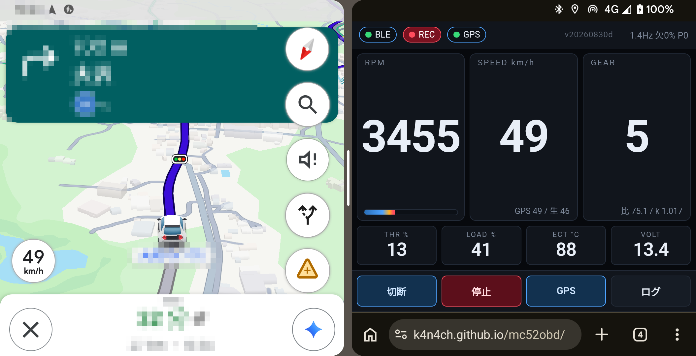
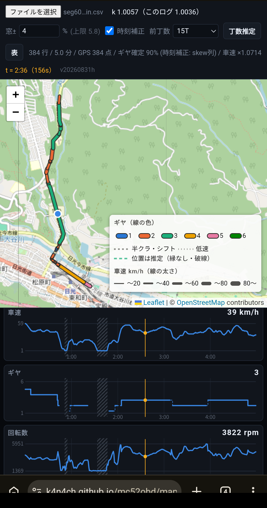

# mc52obd

Honda MC52（CB250R 2018年式）の OBD 診断ポートから何が読めるかを探索する。

| | |
|---|---|
| **走行中のモニタ** | <https://k4n4ch.github.io/mc52obd/> |
| **ログビュワー** | <https://k4n4ch.github.io/mc52obd/map.html> |

モニタは **Android Chrome + HTTPS** が要る（Web Bluetooth が iOS Safari 非対応のため）。
ビュワーは PC ブラウザでも動く。

リポジトリ名は車名ではなく型式に合わせている（`fl4obd` / `thsobd` と同じ）。

停車状態での対応 PID 全数探索から始め、走行中に扱う段はスマートフォン側に載せる。

**作業状況・次の手順・保留事項は [HANDOFF.md](HANDOFF.md) に集約している。**

実測結果は [FINDINGS.md](FINDINGS.md)、フロントスプロケット 14T / 15T の走行余力比較は
[GEARING.md](GEARING.md)。

2 本立てで進めている。互いに上位互換ではなく、敷居と得られるものが違う。

- **Track A** — 市販 ELM327 で簡易的に実現する手段。ドングルと変換ケーブルだけで完結する。
  本リポジトリの `index.html` と `tools/`
- **Track B** — ESP32-S3 ＋ K-Line トランシーバ。回路製作を伴い敷居は高いが、市販ギアポジ
  インジケータには無い高級ロガーとして使える。噴射時間が取れる点が本質的な差。未着手

## 前提

### 物理接続

シート下の赤い 4 ピンカプラ（住友 6187-4441、サービスチェックカプラ）。K-Line 用の
市販「Honda 4pin → OBD2 16pin」変換ケーブルを介して ELM327 を接続する。CAN 用の
アダプタでは通信しない。

| 4pin | 信号 | OBD2 16pin |
|---|---|---|
| 1 | GND | 4 / 5 |
| 2 | SCS（サービスチェック短絡） | — |
| 3 | +12V（IG 連動） | 16 |
| 4 | K-Line | 7 |

12V が IG 連動なので、ドングルの電源は IG ON 時のみ入る（暗電流の心配がない代わりに、
IG ON のたびにドングルの起動待ちが発生する）。

### ドングル

ELM327 の **BLE** タイプを使う。BLE は Classic SPP と違い macOS で `/dev/cu.*` を作らない
ため、pyserial ではなく CoreBluetooth（bleak）で GATT を直接叩く。サービス UUID は
`0000fff0-...` と `e7810a71-...` の 2 種を順に試し、どちらも無ければ notify + write を持つ
キャラクタリスティックを全サービスから探す。

## スマホ用モニタ（index.html）

<https://k4n4ch.github.io/mc52obd/>

車載マウントで走行中に見ることを前提にした単一ファイルの Web アプリ。**Android Chrome +
HTTPS が必要**（Web Bluetooth は iOS Safari 非対応）。fl4obd と同じ構成だが、こちらは
ハイブリッドではないのでエネルギーフロー図に相当するものは無く、計器表示のみ。



分割表示でナビと並べて使える。ヘッダの `BLE / REC / GPS` が接続・記録・測位の状態、右端が
**実効レートと欠測率**（この時 1.4Hz・欠測 0%）。`SPEED` の下の `GPS 49 / 生 46` は GPS 速度と
ECU 生値の併記で、`GEAR` の下の `比 / k` は判定の内訳。**走りながら判定が妥当かを確認できる**
ようにしてある。

取得する PID とポーリングの階層は以下。K-Line の総リクエスト予算が約 6.3 Hz しかないため、
全部を毎周期読むと 1 Hz を切る。速い信号だけを毎周期回す。

| 層 | PID | 用途 |
|---|---|---|
| 速（毎周期） | `0C` 回転数、`0D` 車速、`11` スロットル | 主表示・ギヤ判定 |
| 遅（持ち回り） | `04` 負荷、`42` 電圧、`05` 水温、`03` 燃料系状態 | 副表示 |

**実測で 1 周期 730ms（約 1.4 Hz）、欠測 2〜3%。** かつては欠測が 40% 前後あったが、
原因は K-Line でも要求間隔でもなく**アプリの監視タイマが応答待ちの要求を先取りして
捨てていた**ことだった（`FINDINGS.md`）。先取りを 1.5 秒待つようにして解消している。

`03` は記録のみで表示しない（燃料補正の解釈に必要だが、走行中に見て意味のある値ではない）。
`45` 相対スロットルは実測で常時 0.0 のため採用しない。`0B` 吸気管圧力は脈動でエイリアシング
するため採用しない。

**ギヤポジションは比推定で表示する。** 理論減速比を軸に単一のスケール係数 k を当てる方式で、
`map.html` と同一。判定できない場合は理由を書き分ける。`–` は低速すぎて比が定義できない状態、
`?` は比は出たがどの窓にも入らない状態（半クラ・シフト中）。妥当性を走りながら見るのが目的
なのでヒステリシスは入れていない。

**k は較正しない。閉じた定数である。** k を構成するのは一次減速比・変速比（諸元）と ECU の
固定係数（ファーム定数）だけで、車速センサはファイナルより上流にあるため前後スプロケも実タイヤも
空気圧も摩耗も効かない。較正すべき自由度が存在しないので **k = 1.0057 で固定**している
（実走 5 本 n=1554、新 3 本で 1.0055 / 1.0057 / 1.0064、幅 0.09%）。`localStorage` で
`map.html` と共有するのは**判定窓だけ**。

判定には 2 つの下限を課している。

- **車速 8 km/h 未満は使わない。** 分母が小さすぎて比が暴れる
- **回転数 1,700rpm 未満は使わない。** クラッチを切って惰性で減速すると回転数がアイドル
  （約 1,400）に張り付き、車速との比が偶然どれかの段と一致する。6 速 22km/h の理論値が
  1,470rpm なので**比としては正しく合ってしまい、残差では弾けない**。車速下限があるため
  本物の 1 速でも最低 1,828rpm になり、アイドル上限との間に閾値を置けば正当な判定を失わない
  （実測で落ちるのは 0.66%、その 100% がスロットル全閉）

**表示車速は前スプロケット丁数で補正できる。** ログボタンで開くパネルで選ぶ（12-15T、既定は
純正 14T）。設定は `localStorage` に保存され次回起動時に反映される。**一度も触っていなければ
保存しない** —— 触っていないのに「設定済み」にすると、ビュワー側の丁数自動推定（未設定のとき
だけ発火する）を潰してしまうため。後は 36T 固定。
ECU は純正 14T/36T を固定前提に換算するため、丁数を変えると `0D` が真の車速からずれる。
補正係数は `(前/14)×(36/後)` で、15T なら ×1.0714（実測の 1/0.935 = 1.0695 と 0.18% 一致）。
**補正するのは表示だけで、ログには ECU の生値を記録する。** 補正済みを記録すると設定を
間違えたときに戻せないため。ギヤ判定も生値の比で行う。

## 走行ログビュワー（map.html）

<https://k4n4ch.github.io/mc52obd/map.html>

REC で書き出した CSV を読み込み、経路と時系列を見返す。PC ブラウザと Android Chrome の
双方で動く。走行中に見る画面ではないので、こちらは情報密度を優先している。



- **地図** — OSM 上に経路を描く。**線の太さ = 車速、線の色 = ギヤ**
- **信用できない測位は捨てる** — スマホの Geolocation はトンネル内でも測位を返し続けるが、
  精度半径が数百 m に膨らんだ嘘の座標になる（実測 7 箇所、精度 中央 200〜854m、各 10〜37 秒、
  出口で 245〜806m の飛びが 15 件）。判定は 2 つで、**どちらも元データ上で計算する**。
  - **精度 50m 超**。通常時は 4〜10m なので桁で分離できる
  - **GPS の移動量が OBD 車速と 25km/h 以上ずれる**（微分窓 5 秒）。精度は測位の自己申告
    なので、良いと言いながら座標が凍る坑口の未収束を取りこぼす。実測でこの判定に該当した
    点は 100% が精度不良区間の前後 15 秒以内＝縁を延ばす働き
  
  捨てた区間は**線を切る**（繋ぐと走っていない直線がトンネルを串刺しにする）。`speed_gps` も
  同じ測位由来なので一緒に捨てる（丁数推定が汚れるため）。実測 13,153 行で、トンネルのある
  1 走行が 157 点除外・7 箇所分断、トンネルの無い 2 走行は除外ゼロ
- **捨てた区間は道路形状で補う** — 端点の座標と進行方位を OSRM に渡して経路を引き、**OBD 車速の
  積分**で距離を時間に配分する。**トンネルの同定は不要**で、端点と方位さえあれば経路は一意に
  決まる。進行方位で拘束するのが要点で、拘束しないと分離帯のある道路で反対車線にスナップする。
  補完区間は**長い破線**（推定であることを線種で示す）
  - **合否は「経路長と車速積分の一致」で見る。** 独立に得た 2 つの量なので、一致すれば経路が
    正しいことの裏付けになる。乖離 8% 超、または含意される平均速度が 8〜140km/h の外なら採らない
  - **経路が使えないときは、車速積分が直線距離と一致するかを見る。** 一致すれば直線で引く。
    トンネルは掘り抜きなので実際にほぼ直線で、実測 7 区間中 6 区間で走行距離が直線距離の
    0.95〜1.01 倍だった。OSRM が価値を持つのは経路が実際に曲がっている区間だけ（実測 1 区間、
    走行距離/直線距離 = 1.15）。**直線を引くこと自体は推測だが、独立に得た 2 つの距離が一致する
    ことが裏付けになる**ので、距離が分からないまま端点を繋ぐのとは別物
  - どちらも合わなければ**線を引かない**（黙って消さず、状態行と console に理由を出す）
  - 実測: トンネルのある走行で 7 区間すべてを補完（0.11〜1.08km、乖離 −0.39〜−5.68%）。
    うち 1 区間は龍王峡付近で OSRM が 2.3 倍の迂回路（1.74km）を返したため直線を採った
    （直線 750m / 積分 735m が一致）。トンネルの無い走行では 100m 未満の移動として対象外

  **走行の座標が外部サービス（OSRM 公開サーバ `router.project-osrm.org`）へ送られる。**
  嫌なら `map.html` の `OSRM_ON` を `false` にすると補完ごと止まる（除外と線の分断は残る）。
- **チャート** — 車速 / ギヤ / 回転数 / スロットル / 水温 / 電圧 を時系列で。6 枚の小倍数で
  X 軸を共有し、なぞると全チャートに十字線が出て地図上の位置も連動する。
  **タッチでは縦がスクロール、横がスクラブ**（`touch-action:pan-y` ＋ 横方向を確認してから
  スクラブ開始）。6 枚を積んでいるので、縦を奪うとスクロールできなくなる

**ギヤは CSV に入っていないのでここで算出する。** ログにギヤ列は持たせず、毎回 `rpm` と
`speed_obd` の生値から判定し直す。理論減速比を軸に単一のスケール係数 k を当てる。

**k は較正しない。閉じた定数である。** k を構成するのは一次減速比・変速比（諸元）と ECU の
固定係数（ファーム定数）だけで、車速センサはファイナルより上流にあるため前後スプロケも
実タイヤも空気圧も摩耗も効かない。較正すべき自由度が存在しないので **k = 1.0057 で固定**
している（実測 5 走行 n=1554、新 3 本で 1.0055 / 1.0057 / 1.0064、幅 0.09%）。
ただしログから当てた値をヘッダに併記するので、**前提が崩れれば気づける**（`0D` の切り捨てを
見つけたのがこの比較だった）。画面で変えられるのは判定窓だけ。

**回転数は車速の取得時刻へ線形補間して揃える。** 両者は別リクエストなので取得時刻がずれ、
加速中は比が過大に、減速中は過小になる（実測 +7.3% / −5.8%、符号が加減速で反転する）。
`skew_ms` 列があればその値、無ければ中央周期で近似する。実ログでの効果はギヤ確定率
56% → 65%。ツールバーの「時刻補正」で on/off できる。

**表示車速は前スプロケット丁数で補正する。** ツールバーの「前丁数」で選ぶ。設定は走行画面と
`localStorage` を共有しており、どちらで変えても両方に効く。**補正するのは表示（グラフ・
カーソル値・線の太さの区分）だけで、ギヤ判定には掛けない** —— k は生値に対して定義されて
いるため。実ログで 15T を選ぶと表示車速と GPS 速度の比が 1.000 になり、ギヤ確定率は丁数を
変えても動かないことを確認済み。

**「丁数推定」で GPS から自動入力できる。** 補正係数を `c = Σ(GPS) / Σ(0D)`（和の比。各点の
比を平均すると分母のノイズで上振れする）で測り、`丁数 f の係数 = f / 14` と突き合わせる。
GPS が信頼できる 20km/h 以上のみ使う。設定を保存していない状態で CSV を読むと自動で入り、
以後は手動で上書きできる（保存済みの設定を勝手に書き換えることはしない）。

### 判定窓の上限は諸元から決まる

窓を `|比/予測 − 1| ≤ t` と定義しているので、隣接する 2 段の窓が重ならない条件は

```
r_a(1−t) > r_b(1+t)   →   t < (s−1)/(s+1)     s = r_a / r_b（隣接段の比）
```

全段に同じ窓を使うため、**最も狭い 5-6速（s=1.1233）が上限を決めて 5.81%**。

| 段 | s | 上限 |
|---|---|---|
| 1-2 | 1.5182 | 20.58% |
| 2-3 | 1.3636 | 15.38% |
| 3-4 | 1.2222 | 10.00% |
| 4-5 | 1.1578 | 7.31% |
| **5-6** | **1.1233** | **5.81%** ← これが全体の上限 |

これを超えると隣の段の領域に食い込み、判定が原理的に破綻する。**諸元から算出しているので
車種を変えても手で直す必要は無い。** 入力欄の `max` に設定し、超える値を打ち込んだら丸める。
既定の 4.0% は上限の 69%。

### 丁数の選択肢は実際の品揃えに合わせてある（2026-08 調べ）

| | 設定 | 根拠 |
|---|---|---|
| 前（ドライブ） | **12-15T から選択** | サンスター 品番361 の設定歯数が 12-15T、キタコ `530-1818` は 13/14/15T。**16T 以上は存在しない**。15T でもスプロケットカバーへの干渉が報告されるほどで物理的に大きくできない |
| 後（ドリブン） | **36T 固定（選択肢なし）** | サンスター `RH-133` は **36T（純正歯数）のみ**、NTB `SPH-086R` も 36T。主要メーカーが他を出しておらず、選択肢にする意味が無い |

純正は 14T/36T、520 サイズ 108L。

**丁数の係数は 7.1% 刻みで、GPS の測定誤差 0.5% に対し一桁の余裕がある。** 実ログ 2 本とも
一位の 15T が誤差 -0.0% / 0.5%、次点の 14T が -6.7% / -6.2% と桁で離れ、推定が揺らぐ余地は
無い。補正後の車速/GPS は 0.9995 / 1.0048。

なお前後とも広いレンジ（前 12-18T / 後 28-48T）で総当たりしていた時期は、候補間隔が測定
誤差を下回って実車と違う組（17/41）が首位に来ることがあった。**探索範囲を実在する品揃えに
合わせることが精度の前提**になっている。

**依存は Leaflet のみで、それも地図だけ。チャートは自前描画で依存ゼロ。** 通信できない環境でも
ログの解析は成立させたいため、Leaflet が読めない場合は地図だけを諦めてチャートは描く。

### ドングルの取り違え対策

FL4 用と CB250R 用のドングルは**どちらも `OBDII` を名乗り、BLE の名前では区別できない**。
判定を 2 段構えにしてある。

1. **`BluetoothDevice.id` を記憶して照合** — 同一オリジンで安定した識別子。前回と違うものが
   選ばれたら警告帯を出す。速いが、これ自体は確証にならない
2. **接続後の `ATDPN` で確定判定** — CB250R は K-Line（プロトコル 3/4/5）、FL4 は
   CAN（6 以降）。CAN を検出したら誤ったドングルなので警告して切断する

2 で正しいと確認できたときだけ 1 の記憶を更新するので、ドングルを買い替えても自動で追随し、
誤ったドングルを覚え込むことがない。プロトコルが確定しない場合（バイクの電源が入っていない等）
は接続を維持したまま警告のみ出す。

なおバイク側のドングルは IG 連動で、バイクの電源が入っている間しか電波を出さない。実際に
取り違えが起きうるのは、車が近くにあるガレージ内だけ。

### 記録

REC で OBD と GPS を溜め、停止時に 2 ファイルを書き出す。

- **CSV** — OBD と GPS を時刻で結合した解析用（GPS は 2 秒以内の最近傍 fix を結合）
- **GPX** — 地図用。10 秒を超える間隔で `trkseg` を分割

CSV には**セッションの条件と行ごとの欠測数**も入れている。解析時に「どの版の・どの設定で
取ったログか」をログ自体から判定できるようにするため。

| 列 | 内容 |
|---|---|
| `miss` | 前の行からこの行までに落ちた要求数。脱落を推定でなく直接数える |
| `app` `proto` `p3` `sprocket_f` | 版・プロトコル・要求前の待ち・前丁数。**先頭行のみ** |
| `skew_ms` | 車速と回転数の取得時刻差。後処理で回転数を車速の時刻へ揃えるのに使う |

**記録中は 10 秒ごとに端末内（IndexedDB）へ差分を退避する。** 停止を押すまで 1 バイトも
保存されない作りだと、長時間の記録でタブが落ちたとき全部消えるため。正常に停止できたら
下書きは自動で消える。未完了の記録が残っていれば次回起動時にアラートで提示し、タップで
書き出す（自動では書き出さない）。

以前はダウンロード方式で写しを落としていたが、毎回**全行を直列化し直す**ためコストが
ログ長に比例し、実測で発火ごとに 5〜9 行を取りこぼしていた。差分追記なら O(n) に収まり、
ダウンロードフォルダも汚さない。

ファイル名は**ローカル時刻**（`mc52_2026-08-28_084657.csv`）。`toISOString()` の UTC だと
朝の走行が前日の深夜として保存されて紛らわしいため。CSV 中の `iso_time` は UTC（`Z` 付き）の
ままにしてある —— 解析では一意に解釈できるほうが良い。

書き出しは手動操作でのみ行い、走行データは端末内に留まる。リポジトリに入れる際は
[位置情報の扱い](#位置情報の扱い)に従うこと。

**接続している間は常に Screen Wake Lock を取る。** 画面が消えるとページが hidden になり JS の
タイマーごと凍結するため（fl4obd の実測で 20〜46 秒の凍結を確認済み）。記録の有無に関わらず
計器が止まるので、記録中に限定していない。自動再接続の最中も保持し続け、再接続を諦めた時点で
解放する。

## セットアップ

```bash
python3 -m venv .venv
.venv/bin/pip install -r requirements.txt
```

macOS の Bluetooth 権限（TCC）が必要。初回はターミナルから手で実行して許可ダイアログを
通しておくこと。バックグラウンド起動されたプロセスにはダイアログが出ない場合がある。

## 使い方

```bash
# 周辺の BLE デバイスを列挙してドングルのアドレスを確認
.venv/bin/python tools/pidscan.py --list

# 対応 PID の全数探索（ビットマップ申告分のみ）
.venv/bin/python tools/pidscan.py

# ビットマップに載っていない PID も 0x01-0xFF 総当たり
.venv/bin/python tools/pidscan.py --brute

# 手動で AT コマンドや PID を突く
.venv/bin/python tools/term.py
.venv/bin/python tools/term.py -c ATZ -c ATSP0 -c 0100 -c ATDP
```

K-Line は応答が遅いため、タイムアウトが頻発する場合は `--st 600`（ATST を 600ms 相当に
設定）で伸ばす。

```bash
# 要求前の待ちと ATST を掃引して、行の脱落が最小になる設定を探す
.venv/bin/python tools/p3sweep.py --addr <UUID>
```

`p3sweep.py` は**停車＋アイドリングで測れる**（走行不要）。PID 別の欠測率まで分解して出す。

**当初の仮説（ISO 14230 の P3min を割って ECU に無視される）は棄却された。** 待ち時間と
欠測率に安定した関係が無く、同じ待ち 80ms が 0.0% と 21.5% を行き来する。掃引全体の変動幅
より単一設定の再現ばらつきの方が大きい。周期は待ちぶんだけ素直に伸びるので、**欠測を
減らせても記録レートは上がらない**。記録レートで選ぶと待ち 0ms が最良で、これを既定にした。

実走の脱落 40% の正体は別にあり、**アプリの監視タイマ**だった（`FINDINGS.md`）。
このツールは監視タイマを持たないため、上の掃引結果はその影響を受けていない。

### 解析ツール（実機不要）

```bash
# 諸元から走行余力の表と図を出す（GEARING.md の全数値を再現）
python3 tools/gearing.py
python3 tools/gearing.py --svg      # docs/ に図を生成
python3 tools/gearing.py --verify   # 実走ログとの突合

# 走行ログから時間区間を切り出す（例示用に速度超過を含まない区間を取る）
python3 tools/cutlog.py <csv> <開始秒> <終了秒> -o out.csv

# 絶対時刻をずらす（公開用に走行日時を伏せる。位置は変えない）
python3 tools/shifttime.py <csv> --days -2 --time -3:33
```

`cutlog.py` と `shifttime.py` は同名の `.gpx` があれば一緒に処理する。

## スキャナの動作

1. `ATZ / ATE0 / ATL0 / ATS0 / ATAT1 / ATH1` で初期化し、`ATSP0` で自動探索
2. 最初の実リクエスト後に `ATDP` / `ATDPN` を読み、**実際にロックしたプロトコルを記録**
   （実測で `ISO 14230-4 (KWP FAST)` と確定済み。`ATDPN` = `A5`）
3. サービス01 のサポート PID ビットマップ `0100/0120/.../01E0` を最下位ビットで連鎖して取得
4. 申告された各 PID を実際に読み、J1979 の換算式で値に変換
5. サービス03 / 07 / 0A（DTC）、サービス09、サービス22 の存在を確認

結果は `results/scan_<日時>.json`（AT コマンドの生ログ込み）と同名 `.md`（表形式）に出力する。

## 記録の方針

- 「取れなかった」も理由付きで残す。`declared_no_response`（ビットマップに申告があるのに
  応答しない PID）と `undeclared`（申告が無いのに応答する PID）を分けて記録する。
- サービス09 の `0902`（VIN）は**この車両では非対応**のため、結果ファイルに車台番号は
  含まれない（実測で確認済み）。

### 位置情報の扱い

**位置情報を含むログはリポジトリに入れない。** 今後スマホ GPS と連携して OSM 上に描画する
予定があり、その際に生成されるログが対象になる。GPS ほど直接的ではないが、車速の時系列も
時刻と組み合わせれば経路推定の手がかりになりうるため、扱いを揃える。

- 生の軌跡・GPS ログは **`private/`** に置く。`.gitignore` で弾いてある
- リポジトリに残すのは**解析結果のみ**（ギヤ比のクラスタ、判定閾値、統計値など）
- Car Scanner 等スマホアプリの CSV エクスポートは位置情報列を含みうる。`private/` 経由で
  扱い、`results/` に直接置かない

なお本車両にドライブレコーダーは搭載していないため、NMEA が生成されることはない。

現在 `results/` にあるのは全て**停車状態**のデータで、車速は全サンプル 0 km/h。移動履歴に
相当する情報は含まれていない。

## 2 層あることの整理

| 層 | 取れるもの | 手段 | 状況 |
|---|---|---|---|
| 標準 OBD（ISO 14230-4, K-Line 10400bps） | J1979 標準 PID 24 個と DTC | ELM327 で可 | **実測完了** |
| Honda 独自（Keihin テーブルリード） | 噴射時間、噛み合い状態、RPM と車速の同時取得 | ELM327 では不可。K-Line トランシーバ＋マイコンが要る | **CB250R では未検証** |

すべて **[FINDINGS.md](FINDINGS.md)** に集約した。標準層はプロトコルが
`ISO 14230-4 (KWP FAST)`、ECU アドレス `0x10`、対応 PID は 24 個で、0x01-0xFF の
総当たりでも未申告 PID は出なかった。サービス22 は全 DID が `NO DATA`。

独自層は '05 CBR600RR と CRF250L での先行解析があり、初期化・フレーム形式・チェックサムが
判明している（**CB250R では未検証**）。ELM327 で届かないのは、独自層の起動が 70ms の Low
パルスで、フレームが `72 05 71 XX CS`、チェックサムが総和の 2 の補数と、ISO 14230 と 3 点
すべて異なるため。ELM327 には K-Line に生バイトを流す透過モードが無い。

**真のギヤ位置が存在するかは未確認。** 判明しているテーブル `0xD1` は噛み合い状態
（イン / ニュートラルまたはクラッチ / サイドスタンド）であって段数ではなく、市販の
シフトインジケータ製品も学習操作を要する比推定だった。全テーブル走査で決着する。

## 探索時の注意

- **必ずエンジンをかけた状態で行う。** IG ON のみだと `0D`（車速）と `11`（スロットル
  絶対位置）が申告されているのに `NO DATA` を返す。
- **接続してからエンジンを掛けてはいけない。** クランキングで K-Line セッションどころか
  **BLE リンクごと落ちる**（始動時の電圧降下でドングルがリセットされると思われる）。
  始動してから接続する。セッションが死んだときの復帰は `ATZ` ＋ 明示的な `ATSP5`。
- ELM327 は IG OFF で BLE から消える。給電はイグニッション連動。
- ELM327 は ISO 14230 の**チェックサムバイトを落とさない**。形式バイト `0x8N` の下位 6bit
  （モードバイト以降の長さ）で切ること。
- K-Line は要求間隔が詰まると `NO DATA` を返す。`send_retry()` でリトライしている。

## 関連

- 同ワークスペースの `fl4obd`（Honda Civic FL4 の CAN/UDS を ELM327 経由で読む Web アプリ）と
  ELM327 の AT コマンド層を共有する。差異は物理層が CAN 29bit ではなく K-Line である点。
- `thsobd`（トヨタ THS の UDS 探索）と同じ、先行事例を足がかりにした探索リポジトリ。
