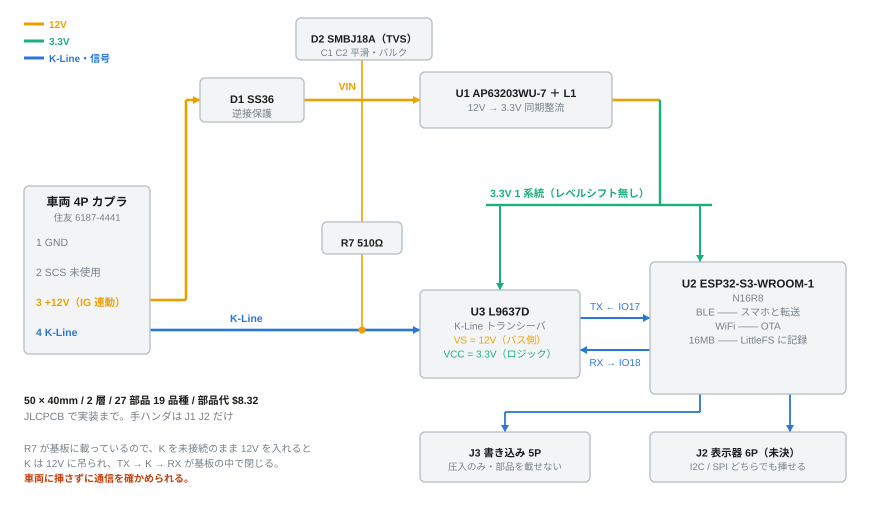
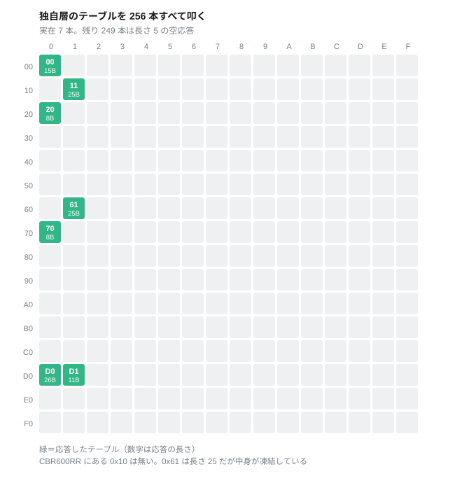
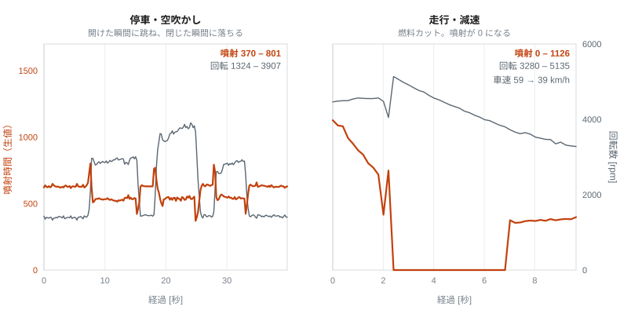
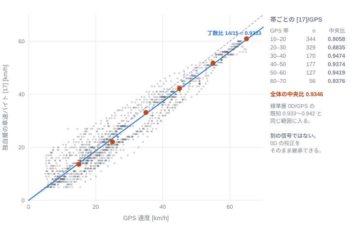
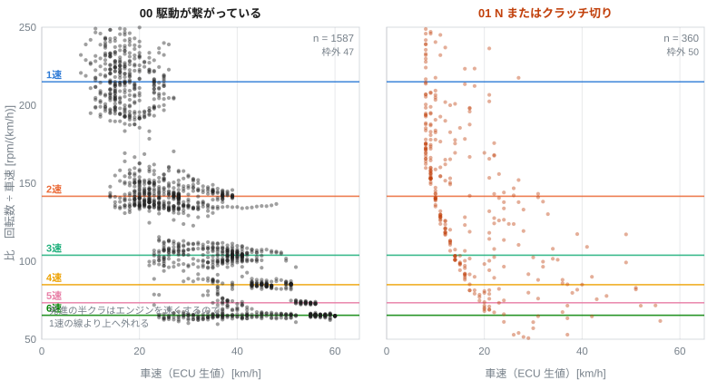
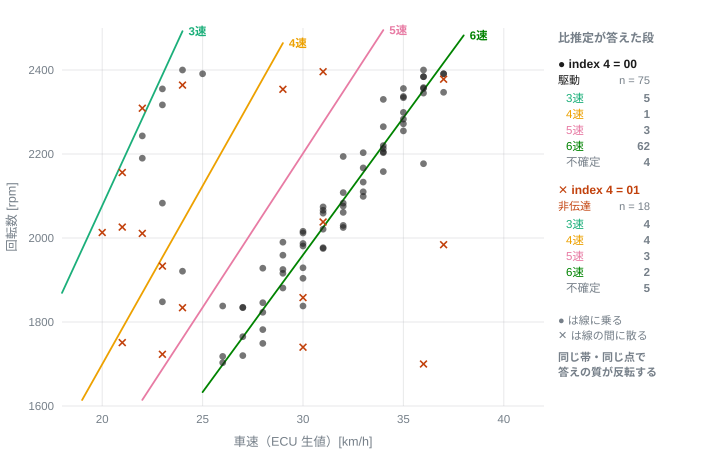
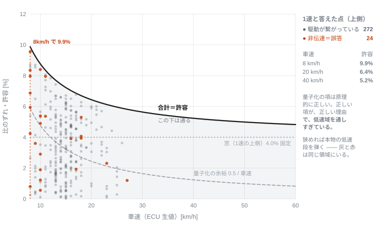
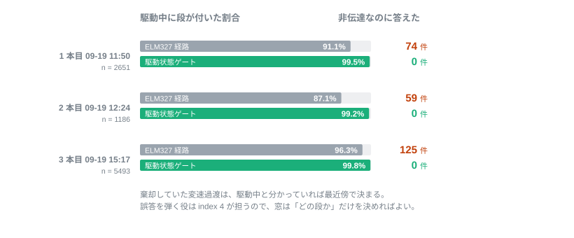

# Honda CB250R（2BK-MC52）K-Line 診断層の探索とメーカー独自テーブルの同定

### — ISO 14230-4 標準層の全数確定と、独自層による比推定の真値評価 —

**Author:** k4n4（mc52obd Project）
**Version:** 1.0（2026-09）

---

## Abstract

本レポートは、Honda CB250R（2018年式、2BK-MC52）の ECU が K-Line 上に持つ診断層を、
外部から観測できる情報のみで同定した記録である。

二輪車の診断ポートは四輪と物理層が異なる。MC52 の場合、シート下の 4 ピンカプラに
出ているのは CAN ではなく K-Line（ISO 14230-4、10400bps）である。ここに市販の
ELM327 を接続し、まず標準 OBD 層（SAE J1979 サービス01）で取得可能な範囲を
`0x01`〜`0xFF` の全数探索によって確定した。結果は 24 個で、サポートビットマップの
申告と実態が完全に一致した。未申告の隠し PID は存在しない。

標準層には、二輪で有用な 3 つの量——ギヤ段・燃料消費・クラッチの断続——がいずれも
無い。このうちギヤ段は、エンジン回転数と車速の比から推定できる。比を構成する
一次減速比・変速比は諸元であり、車速センサはファイナルより上流にあるため、
較正すべき自由度が存在しない。本レポートではこの比推定を定式化し、実走 12 本
28,967 行で確定率 98.1% を得た。同時に、この方式が**原理的に解けない領域**が
存在することを示す。クラッチを切った減速中は、比が意味を失うにもかかわらず
どれかの段と数値的に一致するためである。

残る 2 つの量と、比推定の真値は、メーカー独自層にある。この層は ELM327 の
コマンド体系では到達できない。そこで ESP32-S3 と L9637D による K-Line 直結基板を
設計・製造し、実車で独自層を掴んだ。テーブル総当たり 256 本のうち実在するのは
7 本で、うち `0x11` が噴射時間を含むセンサ群、`0xD1` が駆動の断続を示すフラグを
持つ。ギヤ段そのものを示すフィールドは、実在する 7 本のいずれにも無かった。

独自層の駆動フラグは、比推定の**正解ラベル**として機能する。これにより、それまで
手作業のラベル付けに頼っていた誤判定の計数を機械化し、判定則を過学習の疑いなく
評価できるようになった。評価の結果、誤答率は走行内容によって 4.2%〜12.1% と
3 倍動く。率そのものは指標にならず、生成機構で語るべきであることを示す。

本手法は、標準層で足場を作り、独自層で真値を得て、推定則を評価するという順序を
とる。この順序は特定の車種や機構に依存しないため、他の K-Line 車両や、CAN を
用いる車両の未文書化診断データにも適用できる。

---

## Key Findings

- 標準 OBD 層で取得可能な PID は **24 個**で、`0x01`〜`0xFF` の全数探索で未申告 PID は
  存在しなかった。サービス22（メーカー固有 DID）・VIN・DTC はいずれも非対応である。
- 車速信号 `0D` はファイナルより上流のカウンターシャフトを見ており、**1 km/h 刻みの
  切り捨て**である。この 2 点から、前後スプロケット変更時の挙動とメーター誤差
  **+7.1%（= 15/14）** が測定値を含まない有理数として導出できる。
- ギヤ段の比推定に用いるスケール係数 `k` は**閉じた定数**であり、車両ごとの較正を
  要しない（実測 5 走行 n=1554 で幅 0.09%）。段ごと・向きごとに判定窓を分けることで
  確定率 98.1% を得た。
- 独自層に実在するテーブルは **7 本**（`00` `11` `20` `61` `70` `D0` `D1`）。
  応答チェックサムは総和の 2 の補数で、走査 256 フレームすべてで一致した。
- `0x11` から**噴射時間**を同定した。標準層の `5E`（燃料流量）・`2F`（燃料残量）は
  いずれも非対応であり、この量は独自層にしか存在しない。減速時に 0 となる挙動
  （燃料カット）を確認した。
- `0xD1` の index 4 が**駆動の断続**（`00` 駆動／`01` N かクラッチ切り／`03` サイド
  スタンド）を示す。これが比推定の真値ラベルとなる。
- **ギヤ段そのものを示すフィールドは存在しない。** 実在 7 本を停車 750 サンプルと
  走行 3837 サンプルで確認した。市販シフトインジケータが取り付け時に学習を要求する
  事実と整合する。
- 独自層の駆動フラグを判定に用いると、駆動中に段が付いた割合が 87〜96% → **99% 台**、
  駆動していないのに段を答えた行が **0** になる。ただし標準層と独自層はセッションとして
  排他であり、ELM327 経路にはこのフラグが来ない。
- 誤答率は走行内容に強く依存し、3 本で **4.2% / 6.8% / 12.1%** と 3 倍動く。
  **率を精度として扱ってはならない。**

---

## 目次

1. はじめに
2. 解析対象
3. 解析手法
4. 解析結果
5. フィールドマップ
6. 真値による判定則の評価
7. 考察
8. 制約・未解決事項
9. まとめ
- 参考文献
- 更新履歴

---

## 1. はじめに

本レポートで判明した主要な内容は、二輪車の K-Line 診断層に対して、標準層の取得範囲を
全数で確定し、その外側にあるメーカー独自層を物理量として同定し、さらに独自層を
真値として標準層由来の推定則を評価できたことである。以下では、その前提と方針を述べる。

二輪車の診断情報は、四輪に比べて手掛かりが乏しい。理由は 3 つある。第一に、物理層が
CAN ではなく K-Line である車両が残っており、四輪向けの情報がそのまま当てはまらない。
第二に、標準 OBD の枠組みが四輪を前提に作られているため、二輪固有の量（ギヤ段など）が
定義されていない。第三に、メーカー独自層の仕様は非公開である。

したがって、内部仕様を参照せず、外部から観測できる手掛かりのみで内側を推定する方針を
採る。足場にできる外部情報は次の 3 種類である。

- **標準 PID（SAE J1979 準拠）**：回転数・車速・水温・電圧など。物差しとなる参照信号である。
- **公表諸元**：一次減速比・変速比・タイヤサイズ。各軸の回転関係を固定する幾何アンカーである。
- **外部の独立な観測**：スマートフォンの GPS。車速信号の絶対値を外から与える。

本レポートは 2 つの層を扱う。標準層（サービス01）は ELM327 で読める範囲であり、
独自層（テーブル読み）は ELM327 のコマンド体系では到達できない。後者のために
K-Line を直接叩く基板を設計した（§2.3）。

**2 つの層は上位互換ではない。** 敷居と得られるものが違い、しかも後述するとおり
セッションとして排他である。本レポートでは、標準層で確定した事実を独自層の解釈の
足場として使い、独自層で得た真値を標準層由来の推定則の評価に使う、という双方向の
関係として扱う。

## 2. 解析対象

### 2.1 物理層と接続

診断ポートは**シート下の 4 ピン赤カプラ**（住友 6187-4441、サービスチェックカプラ）
である。市販の「Honda 4pin → OBD2 16pin」変換ケーブルを介して ELM327 を接続する。
CAN 用のアダプタでは通信しない。

**表1. 4 ピンカプラの配線**

| 4pin | 信号 | OBD2 16pin |
|---|---|---|
| 1 | GND | 4 / 5 |
| 2 | SCS（サービスチェック短絡） | — |
| 3 | +12V（IG 連動） | 16 |
| 4 | K-Line | 7 |

12V が IG 連動であるため、ドングルの電源は IG ON 時のみ入る。暗電流を考慮しなくて
よい代わりに、IG ON のたびにドングルの起動待ちが発生する。ピン 2（SCS）は GND へ
落とすと ECU が自己診断モードに入るため、本解析では使用しない。

**表2. 通信の同定結果**

| 項目 | 実測値 |
|---|---|
| プロトコル | **ISO 14230-4 (KWP FAST)**、`ATDPN` = `A5` |
| 物理層 | K-Line 10400bps |
| ECU アドレス | `0x10`（応答ヘッダ `8N F1 10`、テスタ `0xF1`） |

事前の推定（Euro4 適合車なので ISO 14230-4 fast init）は実測で確認された。

実装上の注意を 1 点記す。ELM327 は ISO 14230 の**チェックサムバイトを落とさずに
出力する**。形式バイト `0x8N` の下位 6bit がモードバイト以降の長さであるから、
これで切らないと最終バイトをデータと誤認する。

### 2.2 標準層の全数探索

取得可能な PID を確定するため、サービス01 の `0x01`〜`0xFF` を全数要求した
（264 リクエスト）。サポートビットマップ（`0100` / `0120` / …）の申告と、実際に
応答する PID の集合を比較した。

**探索はエンジンを掛けた状態で行う必要がある。** IG ON のみでは、ビットマップに
申告されているにもかかわらず `0D`（車速）と `11`（スロットル絶対）が `NO DATA` を
返す。この 2 個を取りこぼすと「申告と実態が一致しない」という誤った結論に至る。

### 2.3 独自層への到達手段

標準層に無い量を得るには、メーカー独自層を叩く必要がある。独自層は次の手順を要求する。

| | |
|---|---|
| ウェイクアップ | 70ms のブレーク（K 線を Low に保つ）＋ 初期化フレーム `72 05 00 F0 99` |
| テーブル読み | `72 05 71 TT CS`（`TT` = テーブル番号、`CS` = チェックサム） |
| 応答 | 先頭 `0x02`、2 バイト目が長さ、末尾がチェックサム |

**この手順は ELM327 のコマンド体系に存在しない。** ブレーク長を指定する AT コマンドが
無く、チェックサムの規則が標準層と異なり、「テーブルを読む」という概念が OBD2 の
サービス構造に無い。ドングルの制約ではなく、規格の外側にある。

そこで K-Line を直接駆動する基板を設計・製造した。構成を Fig1 に示す。



**Fig1. 基板のブロック図。** 車両の 4 ピンカプラから 12V と K-Line を受け、`D1`
（逆接保護）を通した `VIN` から `U1`（降圧）で 3.3V を作る。`U3`（L9637D）が
12V 単線と 3.3V ロジックの間を仲介し、`U2`（ESP32-S3）が UART で叩く。
`R7`（510Ω）は K 線のプルアップである。

設計上の判断を 2 点記す。

**電源を 1 系統にした。** 当初は `12V → 5V → 3.3V` の 2 段構成で、L9637D を 5V、
ESP32 を 3.3V で動かし、間にレベルシフトを入れる予定だった。データシートによれば
L9637D の `VCC` は min 3V、TX の H 判定は min 2.5V、内蔵プルアップは `VCC` 行きで
ある。したがって `VCC = 3.3V` なら 5V レールもレベルシフトも不要である。ただし
データシートは「特性は 5V でのみ試験」と明記しているため、**設計保証はあるが試験値
ではない**ものとして扱い、実機で確認するまで確定としなかった。実測では 10400bps で
1024 バイト誤り 0、115200bps でも誤り 0 であり、使用速度に対して 11 倍の余裕がある。

**`R7` を基板上に置いたことで、車両なしで通信経路を検証できる。** カプラを車両へ
接続しなければ K 線は開放端であるから、`VIN` に 12V を与えると K は 12V に吊られる。
この状態で TX を Low にすれば L9637D が K を引き下げ、RX に返る。**TX → K → RX が
基板内で閉じる**ため、配線の入れ違いや短絡を車両へ行く前に切り分けられる。

### 2.4 取得データと既知定数

**標準層のログ**：ELM327（BLE）をスマートフォンの Web アプリまたは Python
（bleak / CoreBluetooth）から駆動し、CSV へ記録した。実走 12 本 28,967 行。
サンプリングは約 1.3Hz（K-Line の往復時間で律速され、1 要求あたり約 158ms）。

**独自層のログ**：前節の基板で `0xD1` と `0x11` を交互に周期読みし、生フレームを
内蔵フラッシュへ追記した。実走 3 本（8.9 分 / 4.0 分 / 18.4 分）、テーブルあたり
5.0Hz。**解釈せずに生バイトで記録する**方針とした。バイト配置が未確定の段階で
解釈して書くと、解釈が誤っていたと判明した時点で過去のログが無価値になるためである。

**GPS**：スマートフォンの Geolocation を端末時計で記録した。基板の時計は接続時に
ページが設定するため、両者は同一時間軸に乗る。

**表3. 参照に用いた標準 PID**

| PID | 物理量 | 変換 |
|---|---|---|
| 01 0x0C | エンジン回転数 | (256A+B)/4 [rpm] |
| 01 0x0D | 車速 | A [km/h]（**切り捨て**、§4.2） |
| 01 0x05 | 冷却水温 | A − 40 [℃] |
| 01 0x0F | 吸気温 | A − 40 [℃] |
| 01 0x11 | スロットル位置（絶対） | 100A/255 [%] |
| 01 0x0E | 点火進角 | A/2 − 64 [deg] |
| 01 0x42 | 制御モジュール電圧 | (256A+B)/1000 [V] |

**表4. 公表諸元（幾何アンカー、2BK-MC52）**

| 項目 | 値 |
|---|---|
| 一次減速比 | 2.807 |
| 変速比 | 1速 3.416 / 2速 2.250 / 3速 1.650 / 4速 1.350 / 5速 1.166 / 6速 1.038 |
| 二次減速比 | 2.571（14T / 36T、純正） |
| タイヤ | 150/60R17（幾何周長 1.9222 m） |
| 車両重量 | 144 kg |
| 最高出力 / 最大トルク | 20 kW / 9,000rpm、23 N·m / 8,000rpm |

**諸元は年式で異なる。** 2022-07 以降の 8BK-MC52 は発生回転数が 9,500 / 7,750rpm で
あり、メーカー公式サイトの諸元ページは現行の 8BK である。2018 年式に適用すると
誤る。

**本車両は前スプロケットを純正 14T から 15T へ変更してある。** §4.2 で述べるとおり、
この変更は車速信号の解釈に影響するが、ギヤ判定には影響しない。

## 3. 解析手法

本章では、各信号の同定に用いた手法を述べる。手順は、全数探索・幾何アンカー・
操作対応・量子化の明示・真値ラベルによる評価からなる。

**全数探索**：標準層は PID を、独自層はテーブル番号を、それぞれ全域にわたって
要求する。目的は「取れるものを見つける」ことではなく、**取れないことを確定する**
ことである。申告と実態の一致、および空応答の識別によって、存在しないものを
存在しないと言えるようにする。

**幾何アンカー**：諸元の減速比とタイヤ径から各軸の回転関係を固定する。これにより、
相関のみでは経験定数に留まる係数を、物理的意味を持つ量へ引き上げる。本車両では
車速センサの取り付け位置（ファイナルより上流か下流か）が、丁数変更時の挙動から
判別できる（§4.2）。

**操作対応**：独自層のバイトは、既知の参照信号との相関が取れない場合がある。その
場合は**操作と変化の対応**で同定する。スロットルを煽る、クラッチを切る、ギヤを
入れる、といった操作を時刻とともに記録し、同期して動くバイトを探す。この目的の
ため、スナップショットではなく周期読みの時系列を取る。

**量子化の明示**：車速 `0D` は 1 km/h 刻みである。丸め方（四捨五入か切り捨てか）を
同定しないまま比を取ると、系統誤差が係数へ吸収される。本レポートでは丸め方を先に
同定し（§4.2）、量子化に由来する不確かさを判定の許容へ明示的に足す（§4.3）。

**真値ラベルによる評価**：推定則の誤りを数えるには、推定と独立な正解が要る。本
レポートでは独自層の駆動フラグを正解ラベルとして用いる（§6）。それ以前は同じログに
手作業でラベルを付けて数えており、**過学習を検出できない**という弱点があった。

**同定・推定・仮定の区別**：本レポートでは、実測で一意に決まったものを「同定」、
複数の観測から矛盾なく説明できるが一意でないものを「推定」、外部から与えた値を
「仮定」と書き分ける。走行抵抗の係数（CdA・Crr）は現時点で仮定であり、実測の
手段は §8 に記す。

## 4. 解析結果

同定は依存連鎖で進む。標準層の全数確定（Step1）を足場に車速信号の素性を決め
（Step2）、その上でギヤ段の比推定を定式化する（Step3）。比推定が原理的に解けない
領域を示した上で（Step4）、独自層へ移り、テーブル構成（Step5）・センサ群（Step6）・
駆動状態（Step7）を同定する。最後に、独自層の車速バイトが標準層と同じ信号である
ことを示し、Step2 の校正を継承する（Step8）。

### 4.1 Step1 標準層で取得可能な範囲の確定

`0x01`〜`0xFF` の全数要求（264 リクエスト）の結果、**取得できるのは 24 個で打ち止め**
であり、サポートビットマップの申告と実態が完全に一致した。**未申告で応答する PID は
存在しない。** 一覧は §5.1 に示す。

取れないことを確定できたものを、理由とともに記す。

| | 結果 |
|---|---|
| サービス22（メーカー固有 DID） | **全 DID が `NO DATA`。** 四輪の FL4 で有効だった経路は使えない |
| `0902`（VIN） | 非対応 |
| DTC（サービス03） | 無し |
| `5E`（燃料流量） | ビットマップに申告が無い |
| `2F`（燃料残量） | 同上 |
| ギヤ段 | 標準 OBD に定義が無い |
| バンク角 | 標準 PID の範囲では取得できない |

**`0B`（吸気管絶対圧）は取得できるが使えない。** 単気筒であるため吸気脈動が平滑
されず瞬時値が返る。アイドル定常で 39〜92kPa に振れ、本サンプリング周期（約 6.3Hz
が上限、実効 1.3Hz）ではエイリアシングする。`45`（相対スロットル）は常時 0.0 で、
実装されていない疑いがある。

**取得周期の上限は約 6.3Hz（158ms/要求）である。** マルチ PID 一括要求は非対応で
あった。要求前の待ち時間を 0〜80ms で掃引したが、待ち時間と欠測率の間に安定した
関係は無く（同じ待ち 80ms が 0.0% と 21.5% を行き来する）、待ちを入れると周期が
その分だけ素直に伸びる。したがって**欠測を減らしても記録レートは改善しない**。

### 4.2 Step2 車速信号の素性

車速 `0D` について、3 つの性質を同定した。いずれも後段の解釈に直接効く。

**(a) 車速センサはファイナルより上流にある。** 本車両は前スプロケットを 14T から
15T へ変更してある。この変更で、それまで GPS より上振れしていたメーター表示が
GPS と一致するようになった。センサがファイナルより下流（車輪側）にあれば、丁数を
変えても車輪の回転そのものは変わらないから、この現象は起きない。**上流にあり、ECU が
純正丁数を前提とした固定係数で km/h へ換算している**と考えると、すべて説明できる。

**(b) 純正状態のメーター上振れは +7.1% である。** (a) の構成を前提とすると、15T 化で
同じ実車速に対するセンサ側の回転が 14/15 に落ちる。それでメーターが実車速と一致した
のだから、**元の上乗せはちょうど 15/14 = +7.1%** だったことになる。

この値が**測定値を一切含まない有理数として出る**ことは重要である。導出の途中で
タイヤ周長も減速比も約分されて消えるため、GPS の精度もタイヤの摩耗も結論に影響
しない。実測でも、15T でのメーター読みと実車速のずれは 0.2% に収まった。

**(c) `0D` は四捨五入ではなく切り捨てである。** 段ごとに独立にスケール係数を当てると、
生値では 2速 1.0213 から 6速 1.0129 まで**単調にずれる**。剛体で連結されている以上、
全段で同一でなければならない。車速に +0.5 を戻すと、ばらつきが 0.83% → 0.13% に
潰れた。この補正によりスケール係数は 1.0148 → **1.0057** となり、ECU が想定している
転がり円周は 1.894 → 1.911 m と解釈できる。

**旧係数 1.0148 に物理的解釈を載せてはいけない。** あれは量子化の偏りを吸収した値
だった。

なお `0D`/GPS の比は、60km/h 以上で 0.9421（n=10,065）であり、丁数比だけの予測
0.9333 より +0.94% 高い。差は ECU が想定する転がり円周と実際の転がり円周のずれで
説明できる。**この差は個体・タイヤ・空気圧に依存するため較正に意味がある**点で、
次節の `k` とは性質が異なる。

### 4.3 Step3 ギヤ段の比推定

エンジン回転数と車速の比は、段ごとに定数となる。理論値は

```
R(n) = 一次減速比 × 変速比(n) × 二次減速比 ÷ (タイヤ周長 × 60 / 1000)
```

で与えられ、1速 213.8 から 6速 65.0 [rpm/(km/h)] である。実測の比 `rpm ÷ (0D + 0.5)`
を `k · R(n)` と比較し、最も近い段を選ぶ。

**`k` は較正しない。閉じた定数である。** `k` を構成するのは一次減速比・変速比（諸元）と
ECU の固定係数（ファーム定数）だけであり、車速センサはファイナルより上流にあるため
前後スプロケットも実タイヤも空気圧も摩耗も効かない。**較正すべき自由度が存在しない。**
実測 5 走行 n=1554 で 1.0055 / 1.0057 / 1.0064（幅 0.09%）であり、判定窓 4% に対して
桁違いに小さい。本レポートでは **`k` = 1.0057** に固定する。

判定には 2 つの下限を課す。

- **車速 8 km/h 未満は使わない。** 分母が小さすぎて比が暴れる。
- **回転数 1,700rpm 未満は使わない。** クラッチを切って惰性で減速すると回転数が
  アイドル（約 1,400）に張り付き、比が偶然どれかの段と一致する。6速 22km/h の理論値が
  1,470rpm であるから、**比としては正しく合ってしまい残差では弾けない**。車速下限に
  より本物の 1速でも最低 1,828rpm になるので、この間に閾値を置けば正当な判定を失わない
  （実測で落ちるのは 0.66%、その 100% がスロットル全閉）。

**判定窓は段ごと・向きごとに独立させる。** 窓を `|比 / 予測 − 1| ≤ t` と定義すると、
隣接する 2 段の窓が触れ合う条件は `t = (s−1)/(s+1)`（`s` は隣接段の比）であり、
これは**その 2 段の間でだけ**成り立つ上限である。段によって 3.5 倍違う。

**表5. 隣接段が触れ合う窓の上限**

| 段境界 | s | 上限 |
|---|---|---|
| 1-2 | 1.5182 | 20.58% |
| 2-3 | 1.3636 | 15.38% |
| 3-4 | 1.2222 | 10.00% |
| 4-5 | 1.1578 | 7.31% |
| 5-6 | 1.1233 | **5.81%** |

全段に同じ値を使うと、判定の厳しさが段ごとに 3.5 倍ばらつく。4.0% は 5-6速では境界
までの 69% を許すのに、1-2速では 19% しか許さない。**最も余裕のある低速段で最も
厳しく切っていた**ことになる。そこで「境界までの何割か」を一定にし、設定値を最も狭い
5-6速での窓として、比率を他の境界へ適用する。

実際の窓にはこれに加えて**車速の量子化に由来する不確かさ `0.5 / 車速`** を足す。
`0D` は 1 km/h 刻みであるから、低速ほど比に対する相対誤差が大きい。

**取得時刻のずれを揃える。** 回転数と車速は別リクエストであるから取得時刻がずれ、
加速中は比が過大に、減速中は過小になる（実測 +7.3% / −5.8%、符号が加減速で反転する）。
行を `0x0C` の応答時に書いていた当初の実装では車速が約 520ms 古く、これがエンジン
ブレーキ中の判定失敗の主因であった。`0x0D` の直後に書くよう変更し、残差を記録した
（中央 182ms）。

以上の結果、実走 12 走行 28,967 行で**確定率 94.02% → 98.14%**（棄却 6.0% → 1.9%）を
得た。窓の変更で既存のラベルは 1 つも変わっていない。割り当ては最近傍のままで、
動くのは棄却閾値だけだからである。回復は低速段に単調に集中し（1速 +24.5%、6速 0）、
段の間隔が広い側ほど取りこぼしていたという予測どおりの形になった。

### 4.4 Step4 比推定が原理的に解けない領域

前節の方式には、窓の調整では解消できない限界がある。

**クラッチを切ると、比は意味を失うが値としては残る。** エンジンと車輪が切り離されて
いるため両者の回転数に力学的な関係は無いが、比は計算できてしまい、しばしばどれかの段の
窓に入る。

具体的には、**車速 28 km/h・回転数 1,959rpm は本物の 6速と数値的に同一**である。
比だけを見てこれを弾くことは原理的にできない。回転数 1,700rpm の下限はアイドル張り付き
を除去するが、この例のように下限を超えるクラッチ切りには効かない。

機構的な制約を課すことで一部は除去できる。シーケンシャル変速機は段を飛ばせないから、
経過時間に比例した変化量の上限 `|Δ段| ≤ max(1, round(Δt / 0.5))` を課す。`0.5` は
実測 12 走行・段の変化 1,202 回で観測された最短の 1 段変化（0.49 秒）そのものであり、
調整値ではない。ただし**これで消せるのは「2 段以上飛ぶ」型だけ**で、1 段ずれる誤判定は
残る。欠測区間をまたぐと許容が経過時間に比例して緩むため、数秒空けば何段でも通る。

**本質的な解は、駆動が繋がっているかどうかを ECU から直接得ることである。** それは
標準層に無い。§4.7 で独自層から取得する。

### 4.5 Step5 独自層のテーブル構成

ウェイクアップは 2 種類を順に試し、**`FE 04 72 8C`（CRF250L 系）**で通った。
CBR600RR 系のシーケンスは使わずに済んだ。**独自層は IG ON（エンジン停止）でも応答する。**

`0x00`〜`0xFF` の 256 本を走査した結果を Fig2 に示す。



**Fig2. テーブル総当たりの結果。** 応答したのは 7 本のみで、緑のセルに応答長を
付した。残り 249 本は長さ 5（`02 05 71 TT CS`、中身なし）を返す。

**応答チェックサムは総和の 2 の補数であり、走査した 256 フレームすべてで一致した
（256/256）。** 先行事例のダンプに残っていた不一致は、先頭バイトの誤記であったと
判断できる。実機の全応答は先頭 `0x02` であった。

**表6. 実在するテーブル**

| | 長さ | 内容 |
|---|---:|---|
| `00` | 15 | keep-alive に使われる静的データ |
| **`11`** | 25 | **センサ群**（§4.6） |
| `20` | 8 | `[4]` が `0x28`〜`0x2B` をゆっくり漂う。ECT・IAT・電圧のいずれとも一致しない。**未同定** |
| `61` | 25 | **凍結データ。** 25 分・暖機の進行をまたいで 152 サンプル全バイト同一 |
| `70` | 8 | 完全に静的 |
| `D0` | 26 | ほぼ 0。`[15-16]` が往復する。単調増加ではないので走行距離系ではない。**未同定** |
| **`D1`** | 11 | **駆動とエンジンの状態**（§4.7） |

**`0x10` は存在しない。** CBR600RR にあるテーブルであり、世代間で構成が異なることを
示す。

**`0x61` に `0x11` の配置を当ててはならない。** 長さが同じ 25 バイトであるため当てたく
なるが、凍結データであり生きていない。当てると回転数 0 / 電圧 1.5V / 車速 5km/h という
値が出る。

手順に関する実測を 3 点記す。

- **keep-alive は不要である。** 5 / 10 / 20 / 40 / 60 秒の無通信を挟んでも 5 回すべて
  テーブルを読めた。先行事例の「`0x00` を 2 秒周期」は MC52 では要らず、その往復を
  実データに回せる（60 秒を超えるタイムアウトは未測定）。
- **ウェイクアップは電源投入後に必須である。** 実行前のテーブル読みは `FF` を 1 バイト
  返すのみである。
- **標準層と独自層はセッションとして排他である。** ウェイクアップ後に標準層を要求すると
  無応答になる。電源を入れ直してウェイクアップ前に要求すれば通る。したがって**この基板は
  ELM327 の代替にもなる**が、**両層を同時には読めない**。

### 4.6 Step6 `0x11` のセンサ群と噴射時間

`0x11` のバイト配置は、先行事例の記載がそのまま当たった。詳細は §5.3 に示す。
標準層で既知の量（回転数・水温・吸気温・電圧・車速・スロットル・点火進角）が並ぶ中に、
**標準層には存在しない量が 1 つある。**



**Fig3. 噴射時間の時系列。** 左は停車・空吹かし、右は走行・減速。アイドルで 611〜648 に
安定し、スロットルを開けた瞬間に 801 まで跳ね、閉じた瞬間に 370 へ落ちる。走行中の
減速では **0** になる（燃料カット）。

**この量は独自層にしか無い。** 標準層の `5E`（燃料流量）と `2F`（燃料残量）はいずれも
非対応であることを §4.1 で確認済みである。

走行 2 本での範囲は 0〜1546、バイトオーダは BE（上位バイト先頭）である。**カット中の
150/167 サンプルが「駆動が繋がっている」状態**であり（残り 17 件はカット中にクラッチを
切った遷移）、エンジンブレーキ中の挙動と整合する。

**単位・スケールは未確定である。** 値 × 回転数の積分と実際の給油量を突き合わせることで
決まるが、1 タンク分の連続記録が要る（§8）。

スロットルの 2 系統も標準層との突合で決まった。`[6]` を `A × 100/255` として換算すると
中央 10.2%・アイドル 10.2% となり、標準層 PID `11`（絶対スロットル）の中央 10.2% と
小数第 1 位まで一致する。`[7]` は全閉で 0 であり、PID `45`（相対スロットル、学習ゼロ点
から測る）に相当する。**アイドル値と最小値の一致で決まったため、全開区間を待つ必要は
無かった。**

点火進角 `[20]` も同様に、標準層 `0E` と同じ符号化（`A/2 − 64`）で読むとアイドルで
両者 9.5° が一致した。

### 4.7 Step7 `0xD1` の駆動状態

停車で状態を 1 つずつ作り、各 15 秒（76 サンプル）ずつ記録した。

**表7. 停車での状態別の値**

| 状態 | index4 | index8 | index9 |
|---|---|---|---|
| A スタンド出す・N・クラッチ離す | `03` | `01` | `00` |
| B スタンド払う・N・クラッチ離す | `01` | `01` | `00` |
| C スタンド払う・N・クラッチ握る | `01` | `01` | `00` |
| D スタンド払う・1速・クラッチ握る | `01` | `01` | `01` |
| ギヤ掃引（エンジン停止、車体を転がしてシフト） | `01` と **`00`** が交互 | `00` | `00` |

**index 4 は駆動が繋がっているかを示す。**

| 値 | 意味 |
|---|---|
| `00` | 繋がっている（ギヤが入り、クラッチも繋がっている） |
| `01` | 繋がっていない（N **または** クラッチを切っている） |
| `03` | サイドスタンドが出ている |

**この 1 バイトが §4.4 の限界を解く。** 減速中のクラッチ切りは `01`、本物の 6速は `00`
であり、比が数値的に同一であっても分離できる。

**index 8 はビットフィールドである。** 停車では `01` / `05` の 2 値であったが、走行で
`0b1001` `0b1101` が加わり 4 値になった。bit 3 は約 15km/h のしきい値で立つ（15km/h
未満では一度も立たない）。**bit 2 は未同定**である。停車時は 2500rpm のしきい値に
見えたが、走行では同じ速度・同じ回転で噴射が 654 と 1176 に分かれるため、回転数
しきい値では説明できない。

#### 状態設計の欠陥により一度誤結論した

A〜D を測った時点で、筆者は「index 4 はサイドスタンドのみを示し、クラッチは `0xD1` に
無い。したがって誤判定は除去できない」と結論した。**誤りであった。**

原因は状態 D を**クラッチを握った状態**で作ったことである。index 4 の定義からすれば
D で `01` が出るのは正しい挙動であり、足りていなかったのは「ギヤが入って、かつ
クラッチが繋がっている」状態である。それが停車では作れないと自身で記述しておきながら、
その穴を埋めずに棄却へ進んだ。**エンジンを切って車体を手で転がせば作れた**（index 4 =
`00` が 0.2〜0.8 秒のバーストで 10 回現れた）。

> **「その状態は作れない」と判断した時点で、棄却の結論は出せない。**
> 作れない状態が真偽を決めるなら、作る方法を先に考える。

### 4.8 Step8 独自層の車速バイトは標準層と同じ信号

`0x11` の `[17]` を GPS と突き合わせた結果を Fig4 に示す。



**Fig4. 車速バイトと GPS。** GPS 精度 15m 以内・両方 5km/h 以上、GPS 側は絶対時刻で
線形補間。n = 1345。青線は丁数比 14/15 = 0.9333。

比は 30km/h 以上で中央 0.939、全体の中央で 0.9346 であり、標準層 `0D` について既知の
0.933〜0.942 と同じ範囲に入る。**別の信号ではない。** したがって §4.2 で確立した校正
——切り捨てなので真値は +0.5、ファイナルより上流、メーター誤差 +7.1%——がそのまま
継承できる。独自層のために校正をやり直す必要は無い。

30km/h 未満の帯で比が低く出て順序も崩れるのは、`0D` の 1 km/h 量子化と GPS 側の雑音に
よる。同じ形は標準層 `0D` の帯別集計でも観測されている。

**切片つきの最小二乗はこの突合に使わない。** 切片が 20km/h 未満の GPS 雑音に引かれ、
実体のない値を返すためである（実測で `0.8974 × GPS + 1.252`、フィルタを振っても傾き
0.90 前後）。帯ごとの中央比で評価する。

### 4.9 ギヤ段フィールドは存在しない

段数そのものを示すフィールドを探した。候補は `0xD1` の index 9 であったが、
**停車のギヤ掃引 750 サンプル、および走行 2 本 3837 サンプルですべて `00`** であった。
走行中はエンジンが運転しており全段を使っているから、段数フィールドであれば値が動く。

実在する 7 本のテーブルに、段数らしい値を取るバイトは無い。**MC52 の ECU は
ギヤ段を診断層へ出していない**と結論する。

この結論は、市販のシフトインジケータが取り付け時に学習を要求する事実と整合する。
あちらも段数を読んでいるのではなく、本レポートと同じ比推定を行っていると考えられる。

## 5. フィールドマップ

### 5.1 標準層（サービス01）

全数探索で確定した 24 個。値はアイドリング時（暖機中、ECT 42℃、1407rpm）の実測。

| PID | 項目 | 生値 | 換算 |
|---|---|---|---|
| `01` | Monitor status since DTCs cleared | `00022000` | — |
| `02` | Freeze DTC | `0000` | — |
| `03` | Fuel system status | `0100` | オープンループ（暖機不足） |
| `04` | Calculated engine load | `69` | 41.2 % |
| `05` | Engine coolant temperature | `52` | 42 ℃ |
| `06` | Short term fuel trim b1 | `80` | 0.0 % |
| `07` | Long term fuel trim b1 | `80` | 0.0 % |
| `0B` | Intake manifold absolute pressure | `2A` | 42 kPa |
| `0C` | Engine speed | `15FC` | 1407 rpm |
| `0D` | Vehicle speed | `00` | 0 km/h |
| `0E` | Timing advance | `A6` | 19.0 deg |
| `0F` | Intake air temperature | `4F` | 39 ℃ |
| `11` | Throttle position | `1A` | 10.2 % |
| `12` | Commanded secondary air status | `01` | — |
| `13` | O2 sensors present (2 banks) | `01` | センサ 1 個 |
| `14` | O2 S1 voltage / STFT | `AC80` | 0.86 V |
| `1C` | OBD standards conformance | `28` | — |
| `21` | Distance with MIL on | `0000` | 0 km |
| `2E` | Commanded evaporative purge | `00` | 0.0 % |
| `41` | Monitor status this drive cycle | `00222020` | — |
| `42` | Control module voltage | `3520` | 13.6 V |
| `45` | Relative throttle position | `00` | 0.0 %（常時 0。未実装の疑い） |
| `51` | Fuel type | `01` | ガソリン |
| `65` | Auxiliary input/output supported | `0400` | — |

サポートビットマップ: `0100`=`FE3EF011`、`0120`=`80040001`、`0140`=`C8008001`、
`0160`=`08000001`、`0180`/`01A0`/`01C0`=`00000001`（連鎖ビットのみ）、`01E0`=`00000000`。

**識別情報**: CalID `0102A20601` / CVN `AA42A9BE` / ECU 名 `ECM -EngineContr…`。
VIN（`0902`）は非対応。

### 5.2 独自層のテーブル

実在する 7 本は §4.5 表6 に示した。以下は同定済みのフィールド。

### 5.3 テーブル `0x11`（長さ 25）

| index | 量 | 変換 | 判定 |
|---|---|---|---|
| 4-5 | エンジン回転数 | BE u16 [rpm] | **同定** |
| 6 | スロットル（生 A/D） | `A × 100/255` [%] | **同定**（標準層 `11` と一致） |
| 7 | スロットル開度（`[6]` の派生） | `0.770 × [6] − 20.08` | **同定**（全閉基準。スケールは推定） |
| 8 / 9 | 冷却水温（生 A/D ／ 換算値） | `[8] × 5/256` [V] ／ `[9] − 40` [℃] | **同定** |
| 10 / 11 | 吸気温（生 A/D ／ 換算値） | 同上 ／ `[11] − 40` [℃] | **同定** |
| 12 / 13 | 吸気管絶対圧（生 A/D ／ 換算値） | 同上 ／ `[13]` [kPa] | **同定**（単気筒の脈動をそのまま返す） |
| 14 15 | 未使用 | 常に `FF` | — |
| 16 | 制御モジュール電圧 | `[16] / 10` [V] | **同定** |
| 17 | 車速 | `A` [km/h]（切り捨て） | **同定**（標準層 `0D` と同じ信号、§4.8） |
| 18-19 | **噴射時間** | BE u16。`値 / 256` [ms] | **同定**（量）。**スケールは推定**（§8） |
| 20 | 点火進角 | `A/2 − 64` [deg] | **同定**（標準層 `0E` と同じ符号化） |
| 21 | 暖機補正（粗） | ≒ 2 × `[22]` | **推定**。水温に一意に従い暖機で減る |
| 22-23 | 暖機補正（細） | BE u16、6338〜8270 | **推定**。目標アイドル回転数が候補。スケール未確定 |

**アナログセンサは「生の A/D 値 ＋ 換算済みの値」の対で並ぶ。** 隣接バイトの相互相関
（対なら ±0.99、16bit 値なら ≒0）と桁上がりの有無で機械的に分離できる。`18-19` は
対に見えるが相関 +0.004 に対し桁上がり 201 件で、**16bit 値**である。噴射時間は
センサではなく ECU が計算して出す指令値なので、対応する生 A/D が存在しない。

`[21]` と `[22-23]` は同じ量の粗／細である。水温が同じでも走行区間と停車区間で値が
違うため第 2 の変数があり、断定しない。

### 5.4 テーブル `0xD1`（長さ 11）

| index | 量 | 値 | 判定 |
|---|---|---|---|
| 4 | **駆動の断続** | `00` 駆動 / `01` N かクラッチ切り / `03` サイドスタンド | **同定** |
| 8 | 状態ビットフィールド | bit 3 ≒ 15km/h しきい値 / bit 2 未同定 | **部分同定** |
| 9 | 不明 | 走行 3837 サンプルすべて `00`。停車で 1 度だけ `01`（条件不明） | **未同定** |

## 6. 真値による判定則の評価

独自層の駆動フラグ（`0xD1` index 4）は、比推定と独立に得られる正解ラベルである。
これにより、判定則の誤りを**手作業のラベル付けなしに**計数できる。実走 3 本
（8.9 分 / 4.0 分 / 18.4 分、合計 9,330 行）で評価した。

### 6.1 駆動状態は比のクラスタの質を分ける



**Fig5. 駆動状態で分けた比の散布。** 横軸は車速、縦軸は比（回転数 ÷ 車速）。比は段ごとに
定数であるから、理論値は水平な 6 本の線になる。左（駆動が繋がっている）は点が 6 本の線に
張り付き、右（N かクラッチ切り）は線と無関係に散る。

左の 1速の帯が線より上へ外れるのは、発進時の半クラッチである。滑るクラッチはエンジンを
駆動系より速くする方向にしか働かないため、必ず 1速の上側に出る。

### 6.2 比が解けない帯で、ラベルの質が反転する



**Fig6. 比が原理的に解けない帯。** 車速 20〜40km/h・回転数 1,700〜2,400rpm を拡大した。
●（駆動）は 75 点のうち 62 点が 6速の線に集まり一貫する。✕（非伝達）は 18 点が
3/4/5/6速に散り、意味を持たない。**同じ帯・同じ点で答えの質が反転する。**

### 6.3 誤答率は走行内容で 3 倍動く

「確定」と答えた行のうち、真値が非伝達であったものを誤答と定義して計数した。

**表8. 走行別の誤答率**

| 走行 | 行数 | 確定 | 誤答 | 率 |
|---|---:|---:|---:|---:|
| 1 本目（市街地中心） | 2,651 | 1,083 | 74 | **6.8%** |
| 2 本目（回転を合わせたシフトダウンを多く含む） | 1,186 | 486 | 59 | **12.1%** |
| 3 本目（通勤経路） | 5,493 | 2,997 | 125 | **4.2%** |

**この率を精度として扱ってはならない。** 3 本で 3 倍動いており、値を決めているのは
判定則ではなく走行内容である。**率ではなく生成機構で語る。**

### 6.4 誤答の生成機構



**Fig7. 許容の内訳と誤答。** 1速と判定した点の上側のみを示す。1速の上側は隣の段が
無いため窓は設定値 4.0% 固定であり、そこへ量子化の不確かさ `0.5 / 車速` が素で足される。
8 km/h では 5.9% となり、合計 9.9% まで許す。

低速側の誤答は、この許容の内側に収まっている。**規則の例外ではなく、規則が通している。**

さらに重要なのは、**正答（灰）と誤答（赤）が同じ領域を占める**ことである。窓を狭めれば
本物の低速段を落とす。量子化の項は原理的に正しく——車速が 1 km/h 刻みである以上、
低速ほど相対誤差が大きいのは事実である——外すこともできない。**正しい項が、正しい理由で、
低速域を通しすぎている。**

高い段では別の機構が働く。2 本目の誤答 59 件は 1速12 / 2速17 / 3速11 / 4速11 / 5速4 /
6速4 に分布し、回転数 2,700〜3,800rpm・車速 16〜29km/h に集中する。**クラッチを切って
回転を合わせている最中**の値が、たまたま別の段の窓に入る。クラッチを切って惰性で転がす
だけなら回転がアイドルへ落ち、比が −30% 外れて不確定になるため誤答にならない。

### 6.5 駆動フラグを判定に用いた効果

駆動が繋がっていなければ段を答えず、繋がっていれば窓を外して最近傍で答える、という
規則に置き換えた。



**Fig8. 駆動状態ゲートの効果。** 駆動中に段が付いた割合が 87〜96% から 99% 台へ上がり、
駆動していないのに段を答えた行が 0 になった。

窓を外したぶんが丸ごと回復している。棄却されていた点の多くは変速過渡であり、駆動中と
分かっていれば段そのものは最近傍で決まるためである。**誤答を弾く役を駆動フラグが担うので、
窓は「どの段か」を決める本来の役目に専念できる。**

### 6.6 この改善は ELM327 経路には及ばない

§4.5 で述べたとおり、標準層と独自層はセッションとして排他である。したがって
**ELM327 を用いる経路には駆動フラグが来ない。** 走行中モニタの判定は比推定のままである。

ただし、標準層側に何も還元されないわけではない。**判定則の案を、手作業のラベルに頼らず
評価できるようになった**ことが本質的な成果である。過学習を検出できない状態から脱した。

## 7. 考察

**手順の一般性。** 本レポートの順序——標準層で足場を作り、独自層で真値を得て、標準層
由来の推定則を評価する——は、特定の車種や機構に依存しない。標準層は「参照信号が既知で
あること」を、独自層は「推定と独立な観測が得られること」を担っており、この役割分担は
プロトコルが CAN であっても成り立つ。

**足場を先に固めることの効果。** 独自層を実車で叩く際、最初に標準層を読んで期待値と
一致することを確認した。これにより、以降に観測される不一致を「ファームウェアの不具合」
ではなく「車両側の未知」として扱えるようになる。切り分けの足場を持たずに未知の層へ
入ると、どちらの問題かを判定できない。

**二輪固有の事情が 2 つある。** 第一に、標準 OBD にギヤ段の定義が無い。四輪では
変速機の状態が標準 PID に含まれることがあるが、二輪では想定されていない。第二に、
単気筒であるため吸気脈動が平滑されず、吸気管圧力が瞬時値として返る。四輪の感覚で
`0B` を負荷の指標に使うと、サンプリング周期次第でエイリアシングする。

**排他性が設計に課す制約。** 標準層と独自層を同時に読めないことは、単なる不便では
なく設計上の分岐点である。走行中のリアルタイム表示を市販ドングルで行う限り、駆動
フラグは使えない。逆に基板を用いれば駆動フラグは使えるが、その間 ELM327 は接続でき
ない。本プロジェクトでは、走行中の道具を ELM327 経路に、解析用の機材を基板に、と
役割を分けて解決した。

**先行事例との関係。** 独自層のフレーム構造とウェイクアップ手順については先行事例が
存在する。本レポートはそれを出発点としたが、MC52 で実際に応答するテーブルの集合は
先行事例と異なり（`0x10` が無い）、バイト配置の妥当性も個別に検証した。**先行事例
からの推定と、MC52 での実測を区別して記述している。** 情報の取得経路と、実装が
参照した範囲の限定については `firmware/PROVENANCE.md` に記録した。

## 8. 制約・未解決事項

**噴射時間の絶対単位が未確定である。** 値 × 回転数の積分と実際の給油量を突き合わせる
ことで決まるが、満タンから次の給油までの連続記録が要る。積分が確定すれば、市販の
シフトインジケータや簡易メーターには無い量——燃料消費そのもの——が得られる。

**走行抵抗の係数は仮定である。** 本プロジェクトのギアリング検討では CdA = 0.60 m²、
Crr = 0.020 を仮定値として置いており、実測で検証していない。**ただし独自層により実測の
経路が開いた。** 噴射時間が 0 の区間はエンジンが純粋な制動要素になるため、駆動フラグと
組み合わせると 2 種類のコーストダウンを切り分けられる。

| 条件 | 減速に効いている力 |
|---|---|
| 駆動フラグ `01`（クラッチ切り）の惰行 | 空気抵抗 ＋ 転がり抵抗のみ |
| 噴射 = 0 かつ駆動フラグ `00` | 空気 ＋ 転がり ＋ エンジンブレーキ |
| **差** | **エンジンブレーキ** |

速度の減衰に `a = −(½ρ·CdA·v² + Crr·mg)/m` を当てれば、`v²` 項と定数項として CdA と
Crr が分離して求まる。**要るのは 60km/h 以上からクラッチを切ったまま数十秒落とす長い
惰行**であり、勾配の小さい道を往復して勾配を相殺する。手元の走行には燃料カットが
167 サンプル含まれるが、市街地で減速区間が短く、`v²` 項を効かせるには足りない。

**未同定のフィールドが残る。** `0xD1` index 8 の bit 2、同 index 9、テーブル `0x20` と
`0xD0` の中身。後者 2 本は主ログに混ぜると分解能が落ちるため、専用の走行で読む必要が
ある。

**サービス `21` / `1A` / `23` / `30` は未試験である。** 否定を確定できたのはサービス22
だけである。

**誤答率の交絡が解けていない。** 3 本で 3 倍動くことは示したが、走行内容のどの要素が
効いているかを分離していない。ログを増やす必要がある。

**`k` が他個体でも通るかは未検証である。** 理論上は較正すべき自由度が存在しないため
同一車種の他個体でもそのまま通るはずだが、確認していない。

**本レポートの数値は 1 個体・1 台のドングル・1 台の基板によるものである。**

## 9. まとめ

Honda CB250R（2BK-MC52）の K-Line 診断層について、以下を同定した。

1. 標準 OBD 層で取得できるのは **24 個**であり、未申告の隠し PID は存在しない。
   サービス22・VIN・DTC はいずれも非対応である。
2. 車速信号はファイナルより上流にあり、**1 km/h 刻みの切り捨て**である。この 2 点から
   純正状態のメーター上振れ **+7.1%** が測定値を含まない形で導ける。
3. ギヤ段の比推定に用いる係数は**閉じた定数**であり較正を要しない。段ごと・向きごとに
   窓を分け、量子化の不確かさを明示的に足すことで確定率 **98.1%** を得た。
4. 比推定には**原理的に解けない領域**がある。クラッチを切った減速中は、比が意味を
   失うにもかかわらずどれかの段と数値的に一致する。
5. メーカー独自層に実在するテーブルは **7 本**であり、そこに**噴射時間**と
   **駆動の断続**がある。**ギヤ段そのものは存在しない。**
6. 駆動の断続を真値ラベルとして用いることで、比推定の誤答を機械的に計数できる。
   誤答率は走行内容により **4.2%〜12.1%** と 3 倍動くため、率ではなく生成機構で
   語るべきである。
7. 誤答の低速側は、**正しい項が正しい理由で低速域を通しすぎている**ことに起因する。
   窓の調整では解消できない。

標準層で足場を作り、独自層で真値を得て、推定則を評価する、という順序は車種に依存
しない。K-Line を用いる他の二輪車、および CAN を用いる車両の未文書化診断データにも
適用できる。

---

## 参考文献

1. SAE J1979 — E/E Diagnostic Test Modes.
2. ISO 14230-4 — Road vehicles, Diagnostic systems, Keyword Protocol 2000, Part 4:
   Requirements for emission-related systems.
3. Honda CB250R factbook（2018-03）. 2BK-MC52 の諸元.
4. STMicroelectronics, *L9637 — Monolithic bus driver with ISO 9141 interface*,
   Datasheet Rev 8.
5. 先行事例（CB250R の診断カプラと取得可能項目）:
   <https://minkara.carview.co.jp/userid/203000/car/2716091/6833398/note.aspx>
6. 独自層のフレーム構造に関する先行解析（CRF250L / CBR600RR）。
   取得経路と参照範囲の限定は [`../firmware/PROVENANCE.md`](../firmware/PROVENANCE.md) に記録した。

**本リポジトリ内の一次資料**

- [`FINDINGS.md`](FINDINGS.md) — 実測の全量（肯定・否定の両方）
- [`GEARING.md`](GEARING.md) — スプロケット丁数と走行余力
- [`gear.md`](gear.md) — ギヤ判定と車速補正の実装仕様
- [`signal-map.md`](signal-map.md) — 独自層のバイトごとの素性（ログから生成）
- [`../hardware/README.md`](../hardware/README.md) — 基板の設計記録
- [`../firmware/SPEC.md`](../firmware/SPEC.md) — ファームウェアの実装仕様

図は `tools/gearing.py --svg` および `tools/figs.py` で再生成できる。後者は実走ログ
（`private/logs/`、個人の移動履歴に当たるため非公開）を要する。

## 更新履歴

| 版 | 日付 | 内容 |
|---|---|---|
| 1.0 | 2026-09 | 初版。標準層の全数確定、車速信号の同定、比推定の定式化、独自層 7 テーブルの同定、駆動フラグによる判定則の評価 |
