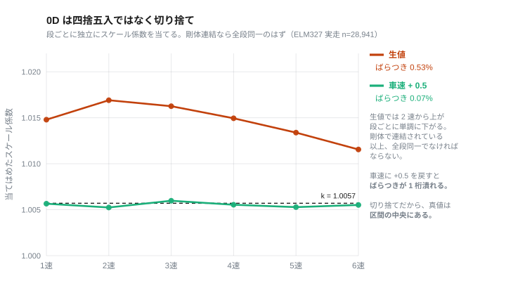
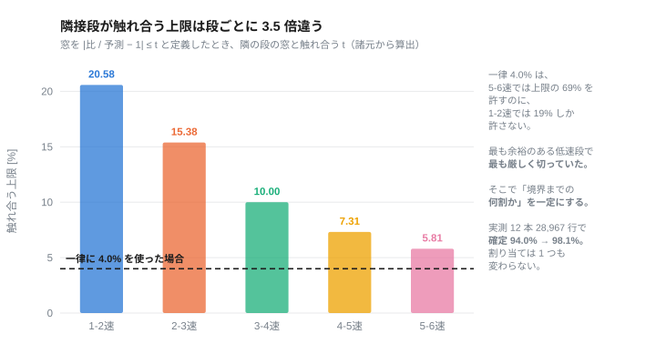
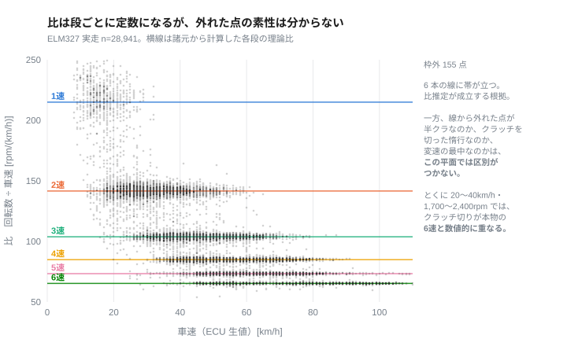

# Honda CB250R（2BK-MC52）標準 OBD 層で取得できる範囲とギヤ段の推定

### — ISO 14230-4 / SAE J1979 の全数確定と、比推定の定式化および原理的限界 —

**Author:** k4n4（mc52obd Project）
**Version:** 1.0（2026-09）

---

## Abstract

本レポートは、Honda CB250R（2018年式、2BK-MC52）の ECU から標準 OBD 層で
取得できる範囲を全数探索により確定し、そこから得られる信号だけでギヤ段を
推定する方法を定式化した記録である。

二輪車の診断ポートは四輪と物理層が異なる。MC52 の場合、シート下の 4 ピン
カプラに出ているのは CAN ではなく K-Line（10,400bps、単線）である。ここに
市販の ELM327 を接続し、サービス01 の `0x01`〜`0xFF` を全数要求した。結果は
24 個で、サポートビットマップの申告と実態が完全に一致した。未申告の隠し PID は
存在しない。サービス22（メーカー固有 DID）・VIN・DTC はいずれも非対応である。

標準層には、二輪で有用な 3 つの量——ギヤ段・燃料消費量・クラッチの断続——が
いずれも無い。このうちギヤ段は、エンジン回転数と車速の比から推定できる。比を
構成する一次減速比・変速比は諸元であり、車速センサはファイナルより上流にある
ため、較正すべき自由度が存在しない。本レポートではこの比推定を定式化し、実走
12 本 28,967 行で確定率 98.1% を得た。

同時に、この方式が**原理的に解けない領域**が存在することを示す。クラッチを
切った減速中は、比が意味を失うにもかかわらずどれかの段と数値的に一致する。
28 km/h・1,959rpm は本物の 6 速と区別がつかない。これは判定窓の調整では解消
できず、駆動が繋がっているかを示す信号を要するが、標準層にはそれが無い。

前段として、車速信号 `0D` の素性を 3 点同定した。ファイナルより上流にあること、
1 km/h 刻みの切り捨てであること、そして純正状態のメーター上振れが
+7.1%（= 15/14）であること。最後の値は測定値を一切含まない有理数として導ける。

本レポートが扱う範囲は、**市販のドングルと変換ケーブルだけで再現できる。**

---

## Key Findings

- 標準 OBD 層で取得可能な PID は **24 個**で、`0x01`〜`0xFF` の全数探索（264 リクエスト）で
  未申告 PID は存在しなかった。サポートビットマップの申告と実態が完全に一致する。
- **サービス22・VIN（`0902`）・DTC はいずれも非対応。** `5E`（燃料流量）と
  `2F`（燃料残量）はビットマップに申告が無い。
- **`0B`（吸気管絶対圧）は取得できるが使えない。** 単気筒の吸気脈動を平滑せず瞬時値で
  返すため、この周期ではエイリアシングする。
- 車速信号 `0D` は**ファイナルより上流**のカウンターシャフトを見ており、
  **1 km/h 刻みの切り捨て**である。この 2 点から、前スプロケット変更時の挙動と
  純正メーターの上振れ **+7.1%（= 15/14）** が測定値を含まない有理数として導ける。
- ギヤ段の比推定に用いるスケール係数 `k` は**閉じた定数**であり、車両ごとの較正を
  要しない（実測 5 走行 n=1,554 で幅 0.09%）。
- 判定窓を**段ごと・向きごとに独立**させ、車速の量子化に由来する不確かさを明示的に
  足すことで、実走 12 本 28,967 行で**確定率 94.02% → 98.14%** を得た。
  既存のラベルは 1 つも変わっていない。
- **比推定には原理的に解けない領域がある。** クラッチを切った減速中は比が意味を失うが
  値としてはどれかの段に一致し、28 km/h・1,959rpm は本物の 6 速と数値的に同一である。
  解くには駆動が繋がっているかを示す信号が要るが、**標準層には存在しない。**
- 取得周期の上限は **約 6.3Hz（158ms/要求）**。マルチ PID 一括要求は非対応。
  要求前の待ち時間と欠測率の間に安定した関係は無く、欠測を減らしても記録レートは
  改善しない。

---

## 目次

1. はじめに
2. 解析対象
3. 解析手法
4. 解析結果
5. フィールドマップ
6. 考察
7. 制約・未解決事項
8. まとめ
- 参考文献
- 関連文書
- 更新履歴

---

## 1. はじめに

本レポートで判明した主要な内容は、標準 OBD 層で取得できる範囲を全数で確定し、
そこから得られる信号だけでギヤ段を推定する方法を定式化したこと、そしてその方法が
原理的に解けない領域を特定したことである。以下では、その前提と方針を述べる。

二輪車の診断情報は、四輪に比べて手掛かりが乏しい。理由は 3 つある。第一に、物理層が
CAN ではなく K-Line である車両が残っており、四輪向けの情報がそのまま当てはまらない。
第二に、標準 OBD の枠組みが四輪を前提に作られているため、二輪固有の量（ギヤ段など）が
定義されていない。第三に、メーカー固有の拡張がどこまで実装されているかが分からない。

したがって、内部仕様を参照せず、外部から観測できる手掛かりのみで内側を確定する方針を
採る。足場にできる外部情報は次の 3 種類である。

- **標準 PID（SAE J1979 準拠）**：回転数・車速・水温・電圧など。物差しとなる参照信号である。
- **公表諸元**：一次減速比・変速比・タイヤサイズ。各軸の回転関係を固定する幾何アンカーである。
- **外部の独立な観測**：スマートフォンの GPS。車速信号の絶対値を外から与える。

**全数探索の目的は「取れるものを見つける」ことではなく、「取れないことを確定する」
ことである。** 申告と実態の一致を確認して初めて、「これで全部」と言える。以降の作業は
その確定した範囲の上に載る。

## 2. 解析対象

### 2.1 物理層と接続

診断ポートは**シート下の 4 ピン赤カプラ**（住友 6187-4441、サービスチェックカプラ）
である。

**表1. 4 ピンカプラの配線**

| 4pin | 信号 |
|---|---|
| 1 | GND |
| 2 | SCS（サービスチェック短絡） |
| 3 | +12V（IG 連動） |
| 4 | K-Line |

**表2. 物理層**

| 項目 | 値 |
|---|---|
| 信号線 | **K-Line 単線**（12V へプルアップされたオープンドレイン） |
| ボーレート | **10,400bps**、8N1 |
| 電源 | +12V、**IG 連動** |

12V が IG 連動であるため、ドングルの電源は IG ON 時のみ入る。暗電流を考慮しなくて
よい代わりに、IG ON のたびに起動待ちが発生する。ピン 2（SCS）は GND へ落とすと
ECU が自己診断モードに入るため、本解析では使用しない。

### 2.2 標準層の読み出し

K-Line 用の市販「Honda 4pin → OBD2 16pin」変換ケーブルを介して **ELM327（BLE）** を
接続する。CAN 用のアダプタでは通信しない。

**表3. 通信の同定結果**

| 項目 | 実測値 |
|---|---|
| プロトコル | **ISO 14230-4 (KWP FAST)**、`ATDPN` = `A5` |
| ECU アドレス | `0x10`（応答ヘッダ `8N F1 10`、テスタ `0xF1`） |

事前の推定（Euro4 適合車なので ISO 14230-4 fast init）は実測で確認された。

**実装上の注意を 1 点記す。** ELM327 は ISO 14230 の**チェックサムバイトを落とさずに
出力する**。形式バイト `0x8N` の下位 6bit がモードバイト以降の長さであるから、
これで切らないと最終バイトをデータと誤認する。

**探索の手順**。取得可能な PID を確定するため、サービス01 の `0x01`〜`0xFF` を全数
要求した（264 リクエスト）。サポートビットマップ（`0100` / `0120` / …）の申告と、
実際に応答する PID の集合を比較する。

**探索はエンジンを掛けた状態で行う必要がある。** IG ON のみでは、ビットマップに
申告されているにもかかわらず `0D`（車速）と `11`（スロットル絶対）が `NO DATA` を
返す。この 2 個を取りこぼすと「申告と実態が一致しない」という誤った結論に至る。

### 2.3 取得データと既知定数

**実走ログ**：ELM327 をスマートフォンの Web アプリまたは Python（bleak /
CoreBluetooth）から駆動し、CSV へ記録した。実走 12 本 28,967 行。サンプリングは
約 1.3Hz。

**記録は復号値と生バイトの両方を残す。** Python 側のロガーは各行に `raw` 列を持ち、
`0C=16AC;0B=46;11=1A;…` の形でその周期の全応答をそのまま保存する。標準層は換算が
規格で定まっているため復号値だけでも失うものは無いが、**検算の手掛かりを残すため**に
生値を併記する。走行中モニタ（`index.html`）は計器であって記録装置ではないので、
復号値のみを出す。

**GPS**：スマートフォンの Geolocation を端末時計で記録した。車速信号の絶対値を
外から与えるために用いる。

**表4. 参照に用いた標準 PID**

| PID | 物理量 | 変換 |
|---|---|---|
| 01 0x0C | エンジン回転数 | (256A+B)/4 [rpm] |
| 01 0x0D | 車速 | A [km/h]（**切り捨て**、§4.2） |
| 01 0x05 | 冷却水温 | A − 40 [℃] |
| 01 0x0F | 吸気温 | A − 40 [℃] |
| 01 0x11 | スロットル位置（絶対） | 100A/255 [%] |
| 01 0x0E | 点火進角 | A/2 − 64 [deg] |
| 01 0x42 | 制御モジュール電圧 | (256A+B)/1000 [V] |

**表5. 公表諸元（幾何アンカー、2BK-MC52）**

| 項目 | 値 |
|---|---|
| 一次減速比 | 2.807 |
| 変速比 | 1速 3.416 / 2速 2.250 / 3速 1.650 / 4速 1.350 / 5速 1.166 / 6速 1.038 |
| 二次減速比 | 2.571（14T / 36T、純正） |
| タイヤ | 150/60R17（幾何周長 1.9222 m） |
| 車両重量 | 144 kg |
| 最高出力 / 最大トルク | 20 kW / 9,000rpm、23 N·m / 8,000rpm |

**諸元は年式で異なる。** 2022-07 以降の 8BK-MC52 は発生回転数が 9,500 / 7,750rpm で
あり、メーカー公式サイトの諸元ページは現行の 8BK である。2018 年式に適用すると誤る。

**本車両は前スプロケットを純正 14T から 15T へ変更してある。** §4.2 で述べるとおり、
この変更は車速信号の解釈に影響するが、ギヤ判定には影響しない。

## 3. 解析手法

本章では、各信号の同定に用いた手法を述べる。手順は、全数探索・幾何アンカー・
量子化の明示からなる。

**全数探索**：PID を全域にわたって要求する。目的は**取れないことを確定する**ことで
ある。申告と実態の一致によって、存在しないものを存在しないと言えるようにする。

**幾何アンカー**：諸元の減速比とタイヤ径から各軸の回転関係を固定する。これにより、
相関のみでは経験定数に留まる係数を、物理的意味を持つ量へ引き上げる。本車両では
車速センサの取り付け位置（ファイナルより上流か下流か）が、丁数変更時の挙動から
判別できる（§4.2）。

**量子化の明示**：車速 `0D` は 1 km/h 刻みである。丸め方（四捨五入か切り捨てか）を
同定しないまま比を取ると、系統誤差が係数へ吸収される。本レポートでは丸め方を先に
同定し、量子化に由来する不確かさを判定の許容へ明示的に足す。

**同定・推定・仮定の区別**：実測で一意に決まったものを「同定」、複数の観測から矛盾
なく説明できるが一意でないものを「推定」、外部から与えた値を「仮定」と書き分ける。

## 4. 解析結果

同定は依存連鎖で進む。全数探索による範囲の確定（§4.1）を足場に車速信号の素性を
決め（§4.2）、その上でギヤ段の比推定を定式化する（§4.3）。最後に、この方式が
原理的に解けない領域を示す（§4.4）。

### 4.1 取得可能な範囲の確定

`0x01`〜`0xFF` の全数要求（264 リクエスト）の結果、**取得できるのは 24 個で打ち止め**
であり、サポートビットマップの申告と実態が完全に一致した。**未申告で応答する PID は
存在しない。** 一覧は §5 に示す。

取れないことを確定できたものを、理由とともに記す。

| | 結果 |
|---|---|
| サービス22（メーカー固有 DID） | **全 DID が `NO DATA`** |
| `0902`（VIN） | 非対応 |
| DTC（サービス03） | 無し |
| `5E`（燃料流量） | ビットマップに申告が無い |
| `2F`（燃料残量） | 同上 |
| ギヤ段 | 標準 OBD に定義が無い |
| バンク角 | 標準 PID の範囲では取得できない |

**`0B`（吸気管絶対圧）は取得できるが使えない。** 単気筒であるため吸気脈動が平滑
されず瞬時値が返る。アイドル定常で 39〜92kPa に振れ、本サンプリング周期（約 6.3Hz
が上限、実効 1.3Hz）ではエイリアシングする。`45`（相対スロットル）は常時 0.0 で、
実装されていない疑いがある。

**取得周期の上限は約 6.3Hz（158ms/要求）である。** マルチ PID 一括要求は非対応で
あった。要求前の待ち時間を 0〜80ms で掃引したが、待ち時間と欠測率の間に安定した
関係は無く（同じ待ち 80ms が 0.0% と 21.5% を行き来する）、待ちを入れると周期が
その分だけ素直に伸びる。したがって**欠測を減らしても記録レートは改善しない**。

### 4.2 車速信号の素性

車速 `0D` について、3 つの性質を同定した。いずれも後段の解釈に直接効く。

**(a) 車速センサはファイナルより上流にある。** 本車両は前スプロケットを 14T から
15T へ変更してある。この変更で、それまで GPS より上振れしていたメーター表示が
GPS と一致するようになった。センサがファイナルより下流（車輪側）にあれば、丁数を
変えても車輪の回転そのものは変わらないから、この現象は起きない。**上流にあり、ECU が
純正丁数を前提とした固定係数で km/h へ換算している**と考えると、すべて説明できる。

**(b) 純正状態のメーター上振れは +7.1% である。** (a) の構成を前提とすると、15T 化で
同じ実車速に対するセンサ側の回転が 14/15 に落ちる。それでメーターが実車速と一致した
のだから、**元の上乗せはちょうど 15/14 = +7.1%** だったことになる。

この値が**測定値を一切含まない有理数として出る**ことは重要である。導出の途中で
タイヤ周長も減速比も約分されて消えるため、GPS の精度もタイヤの摩耗も結論に影響
しない。実測でも、15T でのメーター読みと実車速のずれは 0.2% に収まった。

**(c) `0D` は四捨五入ではなく切り捨てである。** 段ごとに独立にスケール係数を当てると、
生値では 2速 1.0213 から 6速 1.0129 まで**単調にずれる**。剛体で連結されている以上、
全段で同一でなければならない。車速に +0.5 を戻すと、ばらつきが 0.83% → 0.13% に
潰れた。この補正によりスケール係数は 1.0148 → **1.0057** となり、ECU が想定している
転がり円周は 1.894 → 1.911 m と解釈できる。



**Fig1. 車速の丸め方の同定。** 段ごとに独立にスケール係数を当てると、生値（赤）は
2 速から上が段ごとに単調に下がる。剛体で連結されている以上、全段同一でなければ
ならない。車速に +0.5 を戻すと（緑）**ばらつきが 0.53% → 0.07% と 1 桁潰れ**、
固定値 `k` = 1.0057 の線に乗る。**切り捨てだから、真値は区間の中央にある。**

**旧係数 1.0148 に物理的解釈を載せてはいけない。** あれは量子化の偏りを吸収した値
だった。

なお `0D`/GPS の比は、60km/h 以上で 0.9421（n=10,065）であり、丁数比だけの予測
0.9333 より +0.94% 高い。差は ECU が想定する転がり円周と実際の転がり円周のずれで
説明できる。**この差は個体・タイヤ・空気圧に依存するため較正に意味がある**点で、
次節の `k` とは性質が異なる。

### 4.3 ギヤ段の比推定

エンジン回転数と車速の比は、段ごとに定数となる。理論値は

```
R(n) = 一次減速比 × 変速比(n) × 二次減速比 ÷ (タイヤ周長 × 60 / 1000)
```

で与えられ、1速 213.8 から 6速 65.0 [rpm/(km/h)] である。実測の比 `rpm ÷ (0D + 0.5)`
を `k · R(n)` と比較し、最も近い段を選ぶ。

**`k` は較正しない。閉じた定数である。** `k` を構成するのは一次減速比・変速比（諸元）と
ECU の固定係数（ファーム定数）だけであり、車速センサはファイナルより上流にあるため
前後スプロケットも実タイヤも空気圧も摩耗も効かない。**較正すべき自由度が存在しない。**
実測 5 走行 n=1,554 で 1.0055 / 1.0057 / 1.0064（幅 0.09%）であり、判定窓 4% に対して
桁違いに小さい。本レポートでは **`k` = 1.0057** に固定する。

判定には 2 つの下限を課す。

- **車速 8 km/h 未満は使わない。** 分母が小さすぎて比が暴れる。
- **回転数 1,700rpm 未満は使わない。** クラッチを切って惰性で減速すると回転数が
  アイドル（約 1,400）に張り付き、車速との比が偶然どれかの段と一致する。6速 22km/h の
  理論値が 1,470rpm であるから、**比としては正しく合ってしまい残差では弾けない**。
  車速下限により本物の 1速でも最低 1,828rpm になるので、この間に閾値を置けば正当な
  判定を失わない（実測で落ちるのは 0.66%、その 100% がスロットル全閉）。

**判定窓は段ごと・向きごとに独立させる。** 窓を `|比 / 予測 − 1| ≤ t` と定義すると、
隣接する 2 段の窓が触れ合う条件は `t = (s−1)/(s+1)`（`s` は隣接段の比）であり、
これは**その 2 段の間でだけ**成り立つ上限である。段によって 3.5 倍違う。



**Fig2. 隣接段が触れ合う窓の上限。** 諸元から算出した `t = (s−1)/(s+1)`。段によって
20.58% から 5.81% まで **3.5 倍**違う。破線は一律 4.0% を使った場合。

全段に同じ値を使うと、判定の厳しさが段ごとに 3.5 倍ばらつく。4.0% は 5-6速では境界
までの 69% を許すのに、1-2速では 19% しか許さない。**最も余裕のある低速段で最も
厳しく切っていた**ことになる。そこで「境界までの何割か」を一定にし、設定値を最も狭い
5-6速での窓として、比率を他の境界へ適用する。

実際の窓にはこれに加えて**車速の量子化に由来する不確かさ `0.5 / 車速`** を足す。
`0D` は 1 km/h 刻みであるから、低速ほど比に対する相対誤差が大きい。

**取得時刻のずれを揃える。** 回転数と車速は別リクエストであるから取得時刻がずれ、
加速中は比が過大に、減速中は過小になる（実測 +7.3% / −5.8%、符号が加減速で反転する）。
行を `0x0C` の応答時に書いていた当初の実装では車速が約 520ms 古く、これがエンジン
ブレーキ中の判定失敗の主因であった。`0x0D` の直後に書くよう変更し、残差を記録した
（中央 182ms）。

以上の結果、実走 12 走行 28,967 行で**確定率 94.02% → 98.14%**（棄却 6.0% → 1.9%）を
得た。窓の変更で既存のラベルは 1 つも変わっていない。割り当ては最近傍のままで、
動くのは棄却閾値だけだからである。回復は低速段に単調に集中し（1速 +24.5%、6速 0）、
段の間隔が広い側ほど取りこぼしていたという予測どおりの形になった。



**Fig3. 比のクラスタ。** 比は段ごとに定数であるから、理論値は水平な 6 本の線になる。
実測は 6 本すべてに帯が立ち、**比推定が成立する根拠**となる。一方で線から外れた点も
相当数あり、その素性は次節の主題となる。

### 4.4 比推定が原理的に解けない領域

前節の方式には、窓の調整では解消できない限界がある。

**クラッチを切ると、比は意味を失うが値としては残る。** エンジンと車輪が切り離されて
いるため両者の回転数に力学的な関係は無いが、比は計算できてしまい、しばしばどれかの段の
窓に入る。

Fig3 で線から外れていた点がそれにあたる。ただし**その平面では、半クラッチなのか、
クラッチを切った惰行なのか、変速の最中なのかを区別できない。** 区別する情報が
含まれていない。

具体的には、**車速 28 km/h・回転数 1,959rpm は本物の 6速と数値的に同一**である。
比だけを見てこれを弾くことは原理的にできない。回転数 1,700rpm の下限はアイドル張り付き
を除去するが、この例のように下限を超えるクラッチ切りには効かない。

機構的な制約を課すことで一部は除去できる。シーケンシャル変速機は段を飛ばせないから、
経過時間に比例した変化量の上限 `|Δ段| ≤ max(1, round(Δt / 0.5))` を課す。`0.5` は
実測 12 走行・段の変化 1,202 回で観測された最短の 1 段変化（0.49 秒）そのものであり、
調整値ではない。ただし**これで消せるのは「2 段以上飛ぶ」型だけ**で、1 段ずれる誤判定は
残る。欠測区間をまたぐと許容が経過時間に比例して緩むため、数秒空けば何段でも通る。

**解くには、駆動が繋がっているかどうかを示す信号が要る。** 回転数と車速だけでは、
クラッチが繋がっている状態と切れている状態を区別する情報が原理的に不足している。
**その信号は標準層に存在しない。**

**この限界は、どれだけ誤答しているかを測ることもできないという形でも現れる。**
正解ラベルが無いため、誤判定の計数は同じログへ手作業でラベルを付ける以外に方法が
なく、過学習を検出できない。

## 5. フィールドマップ

全数探索で確定した 24 個。値はアイドリング時（暖機中、ECT 42℃、1,407rpm）の実測。

| PID | 項目 | 生値 | 換算 |
|---|---|---|---|
| `01` | Monitor status since DTCs cleared | `00022000` | — |
| `02` | Freeze DTC | `0000` | — |
| `03` | Fuel system status | `0100` | オープンループ（暖機不足） |
| `04` | Calculated engine load | `69` | 41.2 % |
| `05` | Engine coolant temperature | `52` | 42 ℃ |
| `06` | Short term fuel trim b1 | `80` | 0.0 % |
| `07` | Long term fuel trim b1 | `80` | 0.0 % |
| `0B` | Intake manifold absolute pressure | `2A` | 42 kPa |
| `0C` | Engine speed | `15FC` | 1,407 rpm |
| `0D` | Vehicle speed | `00` | 0 km/h |
| `0E` | Timing advance | `A6` | 19.0 deg |
| `0F` | Intake air temperature | `4F` | 39 ℃ |
| `11` | Throttle position | `1A` | 10.2 % |
| `12` | Commanded secondary air status | `01` | — |
| `13` | O2 sensors present (2 banks) | `01` | センサ 1 個 |
| `14` | O2 S1 voltage / STFT | `AC80` | 0.86 V |
| `1C` | OBD standards conformance | `28` | — |
| `21` | Distance with MIL on | `0000` | 0 km |
| `2E` | Commanded evaporative purge | `00` | 0.0 % |
| `41` | Monitor status this drive cycle | `00222020` | — |
| `42` | Control module voltage | `3520` | 13.6 V |
| `45` | Relative throttle position | `00` | 0.0 %（常時 0。未実装の疑い） |
| `51` | Fuel type | `01` | ガソリン |
| `65` | Auxiliary input/output supported | `0400` | — |

サポートビットマップ: `0100`=`FE3EF011`、`0120`=`80040001`、`0140`=`C8008001`、
`0160`=`08000001`、`0180`/`01A0`/`01C0`=`00000001`（連鎖ビットのみ）、`01E0`=`00000000`。

**識別情報**: CalID `0102A20601` / CVN `AA42A9BE` / ECU 名 `ECM -EngineContr…`。
VIN（`0902`）は非対応。

## 6. 考察

**全数探索の価値は否定の側にある。** 24 個という数そのものより、「申告と実態が一致し、
未申告の PID は存在しない」ことが確定した意味が大きい。これにより以降の作業は
「まだ探せば出てくるかもしれない」という留保から解放される。同じことを試す者の
時間も節約できる。

**足場を先に固めることの効果。** 標準層で参照信号（回転数・車速・水温・スロットル・
進角・電圧）の換算が確定していると、それらは後続のあらゆる同定作業で物差しとして
使える。未知の信号に出会ったとき、既知の信号との相関や一致で素性を絞り込める。

**二輪固有の事情が 2 つある。** 第一に、標準 OBD にギヤ段の定義が無い。四輪では
変速機の状態が標準 PID に含まれることがあるが、二輪では想定されていない。第二に、
単気筒であるため吸気脈動が平滑されず、吸気管圧力が瞬時値として返る。四輪の感覚で
`0B` を負荷の指標に使うと、サンプリング周期次第でエイリアシングする。

**較正が要る量と要らない量を分けることが効いた。** ギヤ判定の `k` は構成要素がすべて
諸元とファーム定数なので較正の自由度が無く、定数として固定してよい。一方 `0D`/GPS の
比は実際の転がり円周に依存するので較正に意味がある。両者を混同すると、較正できない
量を較正しようとして量子化の偏りを吸収した値（1.0148）を掴む。

## 7. 制約・未解決事項

**比推定の限界は測ることができない。** §4.4 のとおり、誤判定を機械的に計数するには
推定と独立した正解が要るが、標準層にはそれが無い。確定率 98.1% は「どの段にも
嵌らない点を棄却した残り」であって、「正しく答えた割合」ではない。

**走行余力そのものを検証できない。** 検証には車両が出しているトルクが要るが、標準層に
指標が無い。`04`（計算負荷）は 55→95km/h の定常で 62〜77% と平坦で指標にならず、
`0B` は脈動、`11` はスロットル開度そのもので非線形である。

**燃料消費量が取れない。** `5E`（燃料流量）も `2F`（燃料残量）も非対応であるから、
標準層の範囲では燃費を算出する手段が無い。

**クラッチの断続が取れない。** これが §4.4 の限界の直接の原因である。

**サービス `21` / `1A` / `23` / `30` は未試験である。** 否定を確定できたのは
サービス22 だけである。

**`k` が他個体でも通るかは未検証である。** 理論上は較正すべき自由度が存在しないため
同一車種の他個体でもそのまま通るはずだが、確認していない。

**本レポートの数値は 1 個体・1 台のドングルによるものである。**

## 8. まとめ

Honda CB250R（2BK-MC52）の標準 OBD 層について、以下を確定した。

1. 取得できる PID は **24 個**であり、未申告の隠し PID は存在しない。サービス22・
   VIN・DTC はいずれも非対応である。
2. 車速信号はファイナルより上流にあり、**1 km/h 刻みの切り捨て**である。この 2 点から
   純正状態のメーター上振れ **+7.1%** が測定値を含まない形で導ける。
3. ギヤ段の比推定に用いる係数は**閉じた定数**であり較正を要しない。段ごと・向きごとに
   窓を分け、量子化の不確かさを明示的に足すことで確定率 **98.1%** を得た。
4. 比推定には**原理的に解けない領域**がある。クラッチを切った減速中は、比が意味を
   失うにもかかわらずどれかの段と数値的に一致する。解くには駆動が繋がっているかを
   示す信号が要るが、**標準層には存在しない。**
5. 同じ理由で、**誤判定を機械的に計数することもできない。**

ここまでは市販のドングルと変換ケーブルだけで再現できる。標準層で取得できる範囲は、
これで尽きている。

---

## 参考文献

1. SAE J1979 — E/E Diagnostic Test Modes.
2. ISO 14230-4 — Road vehicles, Diagnostic systems, Keyword Protocol 2000, Part 4:
   Requirements for emission-related systems.
3. Honda CB250R factbook（2018-03）. 2BK-MC52 の諸元.
4. 先行事例（CB250R の診断カプラと取得可能項目）:
   <https://minkara.carview.co.jp/userid/203000/car/2716091/6833398/note.aspx>

## 関連文書

- [`mc52-proprietary-layer.md`](mc52-proprietary-layer.md) — 後編。本レポートが
  「標準層には存在しない」とした 3 つの量を、同じ K-Lineの別プロトコルから取得する
- [`FINDINGS.md`](FINDINGS.md) — 実測の全量（肯定・否定の両方）
- [`GEARING.md`](GEARING.md) — スプロケット丁数と走行余力
- [`gear.md`](gear.md) — ギヤ判定と車速補正の実装仕様

図は `tools/figs.py` で再生成できる。実走ログ（`private/logs/`、個人の移動履歴に
当たるため非公開）を要する。

## 更新履歴

| 版 | 日付 | 内容 |
|---|---|---|
| 1.0 | 2026-09 | 初版。`mc52-kline-analysis.md` を標準層・独自層に分割した前編 |
