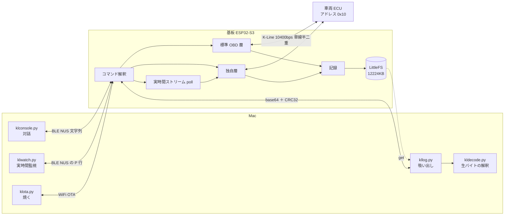
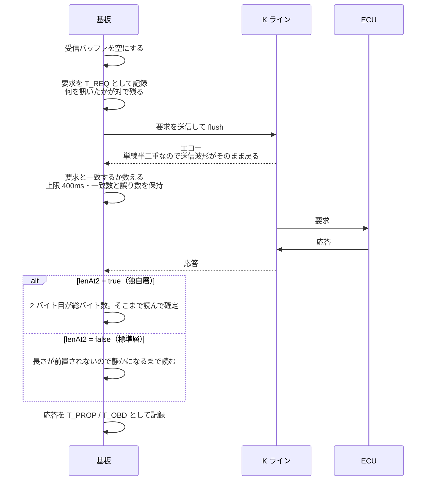
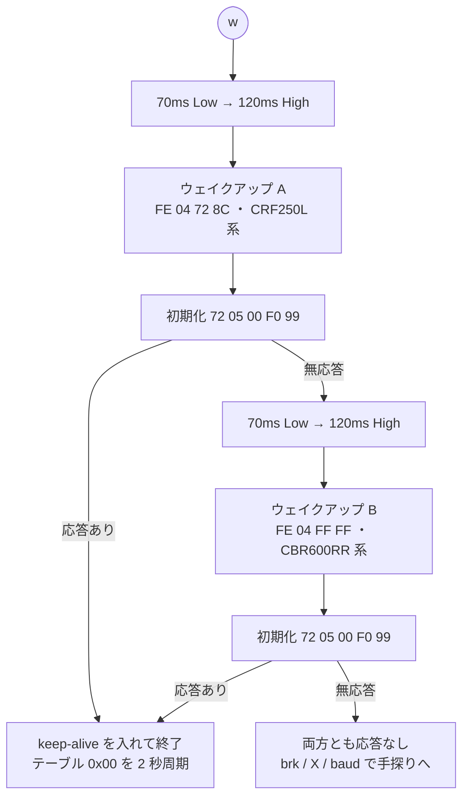
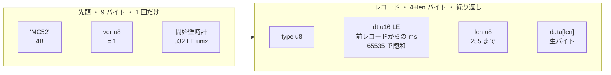
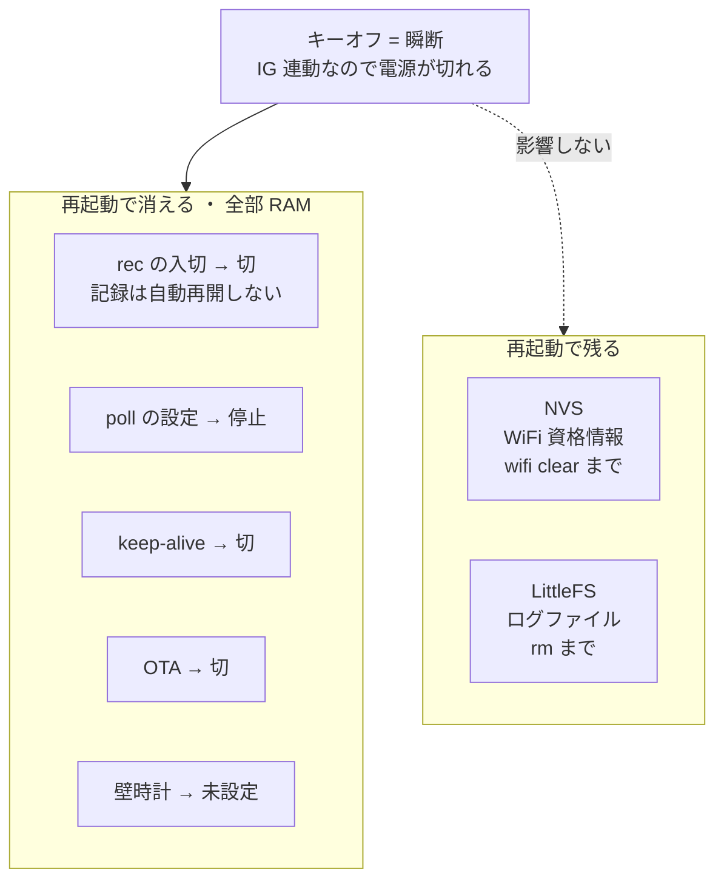
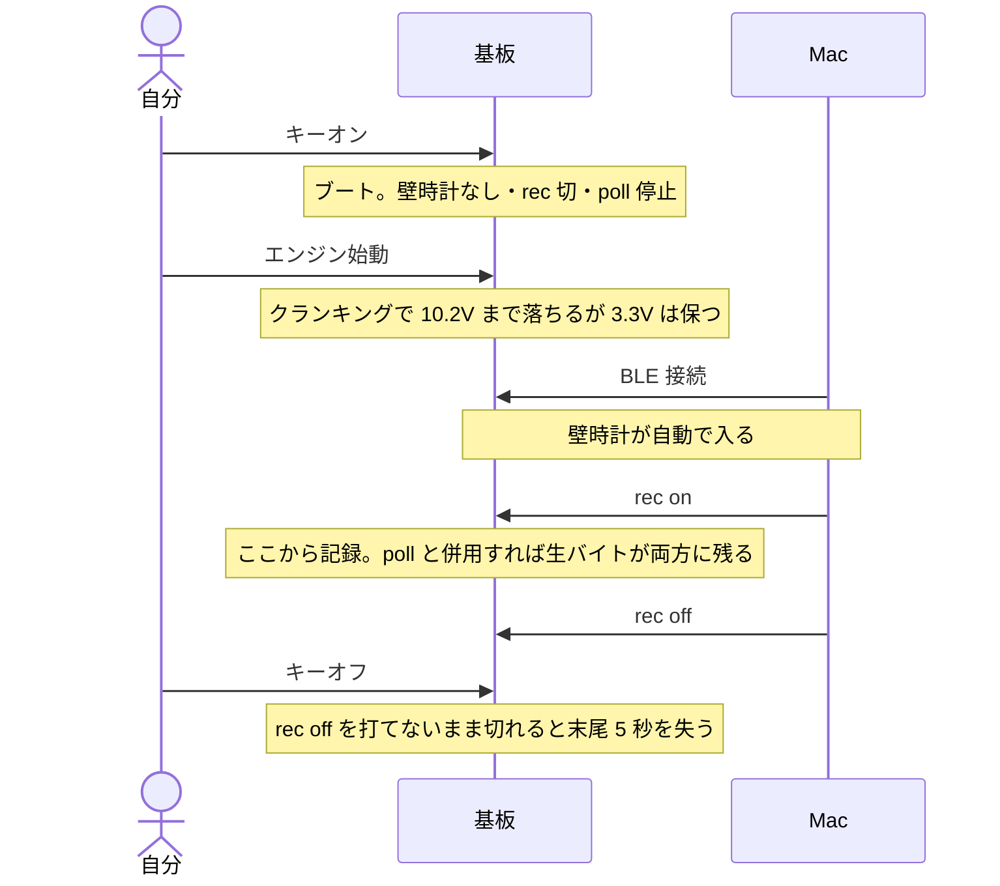

# MC52 探索基板 —— 実装仕様

**いま何が実装されているかを、コードから起こした仕様書。** 使い方は
[`README.md`](README.md)、仕様の出所と信頼度は [`PROVENANCE.md`](PROVENANCE.md)、
受け渡された事実そのものは [`KLINE_PROPRIETARY.md`](KLINE_PROPRIETARY.md)。

この文書は 2 種類の内容を**混ぜずに**書く。

- **実装仕様** —— コードを読めば確かめられる。ここに書いたものは全部そう
- **プロトコルの前提** —— 先行事例（CRF250L / CBR600RR）から受け取ったもの。
  **2026-09-17 に実車で大半が裏付いた**（実測は
  [`../docs/FINDINGS.md`](../docs/FINDINGS.md) の「実車で叩いた結果」）。
  残る未検証は章末の「未検証の前提」に一覧がある

対象は `firmware/src/explore.cpp`（778 行）と `tools/kl*.py`。

---

## 1. 全体の構成



**方針は一つだけ。** 基板は**解釈しない**。生バイトを通し、生バイトを記録する。
テーブルのバイト配置も噴射時間の単位も未確定なので、基板側で解釈して書くと、
解釈が間違っていた時点で過去のログが全部無価値になる。

## 2. ハードウェアの割り当て

| | |
|---|---|
| MCU | ESP32-S3-WROOM-1-**N16R8**（16MB フラッシュ / 8MB PSRAM） |
| K ライン | `IO17` = TX / `IO18` = RX（`HardwareSerial(1)`）。トランシーバは L9637D |
| 表示器（未使用） | `IO9`〜`IO12`（`J2`）。`R3` `R4` 4.7kΩ プルアップ |
| 書き込み | `J3` 圧入 5 極（GND / TXD0 / RXD0 / EN / IO0）。**USB は配線されていない** |
| シリアル | `Serial` = UART0（`J3`）。`ARDUINO_USB_CDC_ON_BOOT=0` が必須 |
| 電源 | `J1` から 12V（IG 連動）→ AP63203 で 3.3V |

**パーティション**（`partitions.csv`、16MB）

| 名前 | 用途 | 大きさ |
|---|---|---|
| `nvs` | WiFi 資格情報 | 20KB |
| `otadata` | OTA の面選択 | 8KB |
| `app0` / `app1` | ファーム 2 面（OTA 用） | 各 2MB |
| **`spiffs`** | LittleFS（ログ） | 0xBF0000 = **12224KB** |

`spiffs` という名前は変えられない。Arduino の LittleFS と PlatformIO の
`uploadfs` がラベル `spiffs` を引くので、`littlefs` と名付けると
`partition "spiffs" could not be found` で落ちる。

## 3. K ラインの物理仕様

**単線半二重。** 送信波形がそのまま RX に戻る（エコー）。

| | |
|---|---|
| 既定ボーレート | 10400bps 8N1（`baud <n>` で変更可） |
| ブレーク | `klBreak(lowMs, highMs)` = UART を落として GPIO で直接叩く |
| エコー | **捨てずに検証する。** 一致数と誤り数を `x` / `X` / `k` が毎回表示する |

**エコーの一致がそのまま物理層の健全性の指標になる。** 配線の入れ違い、GND や
12V への短絡、L9637D の不調が全部ここに出る。車両の前で「通信が通らない」と
なったとき、基板側か車両側かを切り分けられる。

**`k`（折り返し）は車両に挿していない状態で使う。** `R7`（510Ω・VIN→KLINE）が
K を 12V に吊っているので、K が開放端なら TX→K→RX が閉じる。DC の 2 点
（TX=H→RX=1 / TX=L→RX=0）と、乱数 1024 バイトのエコー一致を見る。

### `xfer()` —— 全通信の土台



戻り値は受信長、`-2` は長さバイトが範囲外。**タイムアウトは呼び出し側が渡す。**

## 4. 標準 OBD 層（`o`）

ISO 14230-4 KWP FAST。**ELM327 で既に取れているものの再現で、足場。**
ここが通れば UART・タイミング・エコー処理が正しいと分かるので、独自層が
無反応だったときに「実装が悪いのか MC52 が喋らないのか」を切り分けられる。

| | |
|---|---|
| 初期化 | 25ms ブレーク → `C1 33 F1 81 66` |
| 要求 | `C2 33 F1 01 <PID> <CS>`。`o` は `0C`（回転数）と `0D`（車速）を読む |
| チェックサム | **単純和**（先行バイトの総和） |
| ヘッダ | テスタ `0xF1` / ECU `0x33`（応答は `8N F1 10` 形式） |

**`o` は keep-alive を切る。** 独自層と標準層は同じ物理線を排他で使う。

**さらにセッションとしても排他だった**（2026-09-17 の実測）。`w` の**後**に `o` を打つと
`StartCommunication` に無応答。**電源を入れ直して `w` の前に打つと通る**
（`init 応答 83 F1 10 C1 E9 8F BD` / `0C` = 1436rpm / `0D` = 0km/h）。独自層を解除する
コマンドは未知なので、標準層へ戻すには電源を入れ直す。

## 5. 独自層（`w` / `s` / `t` / `d` / `m`）

**ELM327 では原理的に叩けない層。** fast init は 25ms 固定で、独自層が要求する
70ms ブレークを出せない。**この基板が存在する理由そのもの。**

| 手順 | フレーム | 備考 |
|---|---|---|
| ブレーク | 70ms Low → 120ms High | |
| ウェイクアップ A | `FE 04 72 8C` | CRF250L 系 |
| ウェイクアップ B | `FE 04 FF FF` | CBR600RR 系 |
| 初期化 | `72 05 00 F0 99` | |
| テーブル読み | `72 05 71 <TT> <CS>` | `<CS>` は総和の 2 の補数 |
| keep-alive | `72 05 71 00 18`（テーブル `0x00`）を 2 秒周期 | |

**チェックサムは総和の 2 の補数。** 標準層の単純和とは別物。受信側は
**全バイトの総和が 0 になること**で検証する（`csOk2c`）。

**応答の 2 バイト目が総バイト数。** `xfer(..., lenAt2 = true)` がこれを使って
フレーム境界を決める。

`w` は **A → B の順に自動で両方試し**、初期化に応答した方で止まって
keep-alive を入れる。両方無応答なら報告して終わる。**MC52 は A（CRF250L 系）で通る。**

**MC52 では keep-alive は要らない**（2026-09-17）。`ka 0` にして 5 / 10 / 20 / 40 / 60 秒の
無通信を挟んでも 5 回すべてテーブルが読めた。60 秒を超えるタイムアウトは未測定。
一方 **`w` は電源投入後に必須** —— `w` の前のテーブル読みは `FF` 1 バイトしか返さない。



`s` は `0x00`〜`0xFF` を総当たりし、応答したものだけを表示する（各 200ms 待ち、
間に 25ms）。**MC52 で最初にやること。** 何が実在するか分からない状態では、
ここで得たテーブル番号が以降すべての入力になる。

### 実在するテーブル（2026-09-17 の走査で確定）

`0x00`〜`0xFF` のうち **7 本だけが中身を返す**。残る 249 本は `02 05 71 TT CS`
（長さ 5 = 中身なし）。

| | 長さ | |
|---|---:|---|
| `00` | 15 | keep-alive に使われているもの。静的 |
| **`11`** | 25 | **センサ群** |
| `20` | 8 | `[4]` がゆっくり漂う。正体不明 |
| `61` | 25 | **凍結データ。** 25 分・暖機の進行をまたいでバイト同一 |
| `70` | 8 | 静的 |
| `D0` | 26 | ほぼ 0。`[15-16]` が往復する |
| **`D1`** | 11 | **駆動とエンジンの状態** |

**`0x10` は存在しない**（CBR600RR のテーブル）。`m` が `0x11` の次に読むので、
無応答の 200ms を捨てている。**`0x61` に `0x11` の配置を当ててはいけない** ——
長さが同じ 25 バイトだが凍結データで、当てると RPM 0 / 電圧 1.5V / 車速 5km/h が出る。

### 解釈を付けている 2 箇所

- `0xD1` の **index 4 = 駆動が繋がっているか**。**実測で 3 値とも再現**
  （`0x00` 繋がっている / `0x01` N またはクラッチを切っている / `0x03` サイドスタンド）。
  同じテーブルの **index 8 はエンジン状態**（`00` 停止 / `01` 運転 / `05` 2500rpm 超）で、
  rpm を測っているので情報が増えない。**index 9 は正体不明**（エンジン運転中 × 1 速の
  ときだけ `01`）
- `0x11` の**センサ群**。RPM[4-5] / スロットル[6][7] / ECT[8-9] / IAT[10-11] /
  MAP[12-13] / 電圧[16] / 車速[17] / **噴射時間[18-19]**。**RPM・ECT・IAT・電圧・車速は
  実測で妥当な値**。噴射時間は位置だけで、単位も endian も不明なので BE / LE 両方を出す

**解釈は表示の都合でしかない。** 記録されるのは生バイトなので、位置が外れていても
過去のログは無価値にならない。

## 6. 実時間ストリーム（`poll`）

**スナップショットでは操作と変化の対応が取れない。** クラッチを握る瞬間や
空吹かしの瞬間に**どのバイトが動くか**を見るための層。

```
poll <TT..> [周期ms]     開始（テーブルは 16 進 2 桁、最大 8 個、既定 200ms）
poll off                 停止
poll                     現在の状態
```

引数は**自前で切っている**。2 桁までをテーブル、3 桁以上を周期 ms と解釈する
（既存の `hexBytes` は非 16 進を読み飛ばすので `poll D1 11 200` を
`D1 11 20 00` と読んでしまう）。周期は 20〜60000ms にクランプ。

**出力形式**（人向けの日本語出力とは混ぜない。文言を変えても受け手が壊れない）

```
P <経過ms> <TT> <hex..>      応答
P <経過ms> <TT> -            無応答
```

`<経過ms>` は `poll` 開始からの `millis()` 差。**記録側の `dt` とは別系統。**

| 仕様 | 内容 |
|---|---|
| 周期の基準 | サイクル**開始**基準（レート制御）。1 サイクルが周期を超えたら詰めずに即次へ |
| keep-alive | `poll` 中は自動で止める（通信自体がセッションを維持する） |
| BLE 切断 | **止めない。** notify は出ないが polling と記録は続く |
| 記録との関係 | `xfer()` が要求と応答を両方 `logRec` するので、`rec on` と併用すれば**同じバイトがファイルにも残る**。記録側に改造は無い |

**無応答のほうが遅い。** 応答すれば 60〜85ms で終わるが、応答しないテーブルは
待ち 200ms を使い切る。**`s` の結果で実在するテーブルに絞らないと、ここで周期を
捨てる。**

## 7. 記録（`rec` / `ls` / `df` / `rm` / `note`）

### ファイル形式



| type | 意味 |
|---|---|
| `0x01` | 独自層の応答 |
| `0x02` | 標準層の応答 |
| `0x03` | **要求**（何を訊いたか） |
| `0x10` | メモ（`note` の文字列） |

| 制約 | 内容 |
|---|---|
| `len` | **255 まで。** 超えるレコードは黙って捨てられる |
| `dt` | **65535ms で飽和する。** 記録中に 65.5 秒を超える無通信があると、そこから先の時刻復元が実際よりも詰まる |
| 書き出し | 4096 バイトたまるか **5 秒**で追記。IG 連動で電源が切れるので、末尾最大 5 秒ぶんは失われる。LittleFS は copy-on-write なのでそれ以前は壊れない |
| 名前 | `rec on <名前>` → `/<名前>.bin`。省略すると `/YYYYMMDD_HHMMSS.bin`。**空白は `_` に置換**（転送の `BEGIN` 行が空白区切りなので名前に空白が入ると解析が壊れる） |
| 壁時計 | `1700000000` 未満なら「時刻が未設定」と警告する |

### 転送（`get`）

```
BEGIN <パス> <サイズ>
<base64 の行が続く。1 行 = 45 バイト = 60 文字>
END <CRC32 の 8 桁 hex>
```

Mac 側（`kllog.py`）は `BEGIN` / `END` を**行の最後のトークンから**取り、
base64 を連結して CRC32 を検算する。実測 25KB/s。

## 8. BLE の仕様

Nordic UART 相当。

| | |
|---|---|
| デバイス名 | `MC52-explore` |
| サービス | `6e400001-b5a3-f393-e0a9-e50e24dcca9e` |
| RX（Mac → 基板） | `…0002`。`WRITE` / `WRITE_NR` |
| TX（基板 → Mac） | `…0003`。`NOTIFY` |
| MTU | 247 要求 |

**出力は 180 バイトで刻み、間に 6ms 待つ。** 詰めすぎると BLE スタックが詰まる。

**受け手には逐次 UTF-8 デコーダが要る。** バイト数で刻んでいるので多バイト文字が
区切りをまたぐ。通知ごとに独立して decode すると日本語が化ける（実機で確認）。

**探索は名前ではなくサービス UUID で行う。** macOS は一度見たデバイスの名前を
キャッシュし、ファームを入れ替えても古い名前を返し続ける（`explore` を焼いた
後も `MC52-selftest` と表示された）。

**入力の行分割** —— `\n` か `\r` で 1 コマンド。**改行なしで届いた write も
1 コマンドとして扱う**（端末によって付かないため）。コマンドバッファは 128 バイト。

**同時接続は 1 本。** `klconsole.py` と `klwatch.py` は排他。

## 9. WiFi と OTA

**`J3` のジャンパ操作を無くすため。** 探索フェーズは「仮説が外れたら試す」の
繰り返しで、焼き直しの回数が読めない。

```
wifi                    登録済み SSID の一覧（パスワードは表示しない）
wifi <ssid> <pass>      NVS に保存（最大 4 件）
wifi clear              全消し
ota on                  接続して OTA を有効化し、IP と RSSI を返す
ota off                 無効化して WiFi を切る
```

| | |
|---|---|
| 保存先 | NVS 名前空間 `mc52`、キー `s0..s3` / `p0..p3` / `wn` |
| 選択 | `WiFiMulti` が**見えているものを自動で選ぶ**。家とテザリングを両方入れておける |
| 接続待ち | 25 秒 |
| mDNS | ホスト名 `mc52-explore` |
| 既定 | **切。再起動で切に戻る。** LAN に無認証の書き込み口を開き続けない |

**SSID とパスワードはソースに書かない。** このリポジトリは PUBLIC。NVS は
暗号化されていないので、機密扱いの資格情報は入れない。`klconsole.py` は
`!log` に `wifi` 行を伏せて書く。

**`J3` は最後の逃げ道として残す。** 壊れたファームを飛ばすと BLE も OTA も死ぬ。

## 10. 状態の寿命 —— 何が再起動で消えるか

IG 連動なのでキーを切るたびにブートする。**ここを取り違えると記録が取れない。**



| 状態 | 寿命 |
|---|---|
| WiFi 資格情報 | **NVS に残る**（`wifi clear` まで） |
| ログファイル | **LittleFS に残る**（`rm` まで） |
| `rec` の入切 | **RAM。再起動で切に戻る**（記録は自動再開しない） |
| `poll` の設定 | RAM。再起動で停止 |
| keep-alive | RAM。`w` で入り、`poll` 中は止まる |
| OTA | RAM。**再起動で切** |
| 壁時計 | RAM。**再起動で消える。** BLE 接続時に Mac から自動送信される |

**帰結: エンジン始動 → BLE 接続 → `rec on` の順で固定。** 逆順だと始動時の
ブートで記録が消える。



## 11. 実測値

| | 実測 | 条件 |
|---|---|---|
| OTA | 1415793 バイトを **41 秒** | 自宅 WiFi、2026-09-16 |
| `get` | **25KB/s** | base64 + notify |
| `poll` 2 テーブル | **2.04Hz** | ECU なし（全部無応答＝待ち 200ms を使い切る） |
| `poll` 1 テーブル | **3.3Hz** | 同上 |
| K ライン | 10400bps で 1024 バイト誤り 0。**115.2kbps まで誤り 0 = 速度で 11 倍の余裕** | L9637D を VCC=3.3V で駆動（データシートの試験条件は 5V のみ） |
| ファーム | Flash 67.5%（1415793 / 2097152）/ RAM 22.8% | `explore` |

**応答があれば `poll` はこれより速くなる。** 上の数字は無応答時の下限 ——
**実車（`D1` ＋ `11` が両方応答）では 5.0Hz**（749 周期 / 150 秒、2026-09-17）。

実車で追加した実測。

| | 実測 | 条件 |
|---|---|---|
| `poll D1 11` | **5.0Hz** | 2 本とも応答。机の上の 2.04Hz は全無応答で待ちを使い切っていたため |
| エコー誤り | **0**（5/5 バイト × 5 回） | 車両に挿した状態。ECU のプルアップとハーネスが入っても机の上と同じ |
| `get` の転送 | 1 回目 116816 / 117086 で **CRC 不一致**、2 回目で一致 | BLE の通知落ちは起きる。**CRC が捕まえる** |
| 独自層セッション | 60 秒の無通信で**落ちない** | keep-alive 停止（`ka 0`）で確認 |

## 12. Mac 側の道具

| 道具 | 役割 |
|---|---|
| `klconsole.py` | 対話コンソール。`!` で始まる行だけ手元で処理し、他は素通し。**基板のコマンドを増やしてもここは直さなくていい**。接続時に壁時計を自動送信 |
| `klwatch.py` | `poll` の受け手。バイト格子と**動いたバイトの強調**。出すのは現在値・**種類（取った異なる値の数）**・スパークラインの 3 つだけで解釈を含まない。画面下の行は基板へ素通し |
| `kllog.py` | ログの吸い出しと CRC32 検算。既定の出力先は `private/logs`（git 管理外） |
| `kldecode.py` | レコード分解・時刻復元・テーブル番号の取り出し・チェックサム検算。CSV 出力 |
| `klota.py` | BLE で `ota on` → IP を拾って `pio run -e explore_ota -t upload` |

**`klwatch.py` の読み方** —— 種類 **1 なら定数、2 なら旗、多いなら量**。
これが解釈を含まない唯一の同定手段。

## 13. 前提の検証状況

出所と信頼度の詳細は [`PROVENANCE.md`](PROVENANCE.md)、実測は
[`../docs/FINDINGS.md`](../docs/FINDINGS.md) の「実車で叩いた結果」。

**裏付いたもの（2026-09-17、実車・停車）**

| 前提 | 出所 | 実測 |
|---|---|---|
| ブレーク 70ms | 先行事例 | 通る |
| ウェイクアップ `FE 04 72 8C` | CRF250L | **これで通る。** CBR 系 `FE 04 FF FF` は使わずに済んだ |
| 初期化 `72 05 00 F0 99` | 先行事例 | 応答 `02 04 00 FA` |
| テーブル読み `72 05 71 TT CS` | 先行事例 | 通る |
| チェックサム = 総和の 2 の補数 | 先行事例 | **走査 256 フレームで 256/256 一致** |
| 応答の先頭 `0x02` / 2 バイト目 = 長さ | 先行事例 | 全フレームで成立 |
| ボーレート 10400 | 標準層の実績 | 独自層でも成立 |
| `0xD1` index 4 = 噛み合い状態 | 位置は 2 系統、値は CBR のみ | **3 値とも再現**（`00` 駆動 / `01` N かクラッチ / `03` スタンド） |
| センサ群のバイト配置 | CRF250L | **`0x11` で当たった。** RPM・ECT・IAT・電圧・車速が妥当な値 |

**外れたもの・条件が違ったもの**

| | |
|---|---|
| keep-alive = テーブル `0x00` を 2 秒周期 | **MC52 では不要。** 60 秒の無通信でも落ちない |
| テーブル `0x10`（CBR600RR） | **MC52 に存在しない** |
| `0x61` を `0x11` と同じ配置で読む | **凍結データで生きていない** |

**まだ未検証**

| | 決め方 |
|---|---|
| 噴射時間 `[18-19]` の単位・endian・スケール | 走行ログ |
| 車速 `[17]` の校正 | 走行ログと GPS の突合 |
| ギヤ位置（段数）が存在するか | 走行中に index 9 が段数で変わるか |
| `0x11` の `[6]` `[7]` `[23]`、`0x20`、`0xD0` の中身 | 未着手 |
| セッションのタイムアウト（60 秒超） | 未測定 |
| ウェイクアップ応答 `0E 04 72 7C` の意味 | 未着手。2 セッションで同一なのでビット化けではない |

**土台（`x` / `X` / `brk` / `baud`）はこの表のどれが外れても動く。**
焼き直さずに振れるように作ってある。
