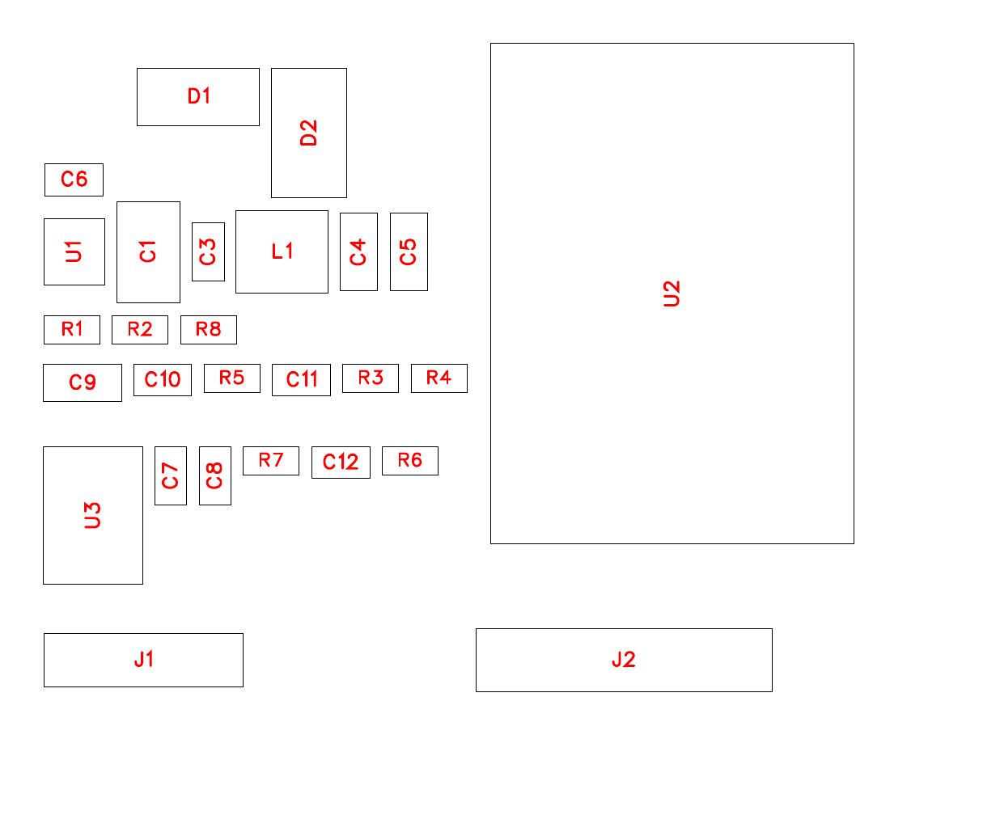

# Track B 基板（ESP32-S3 ＋ L9637D）

CB250R / MC52 の K-Line を ELM327 を介さず直接叩き、**噴射時間**を取るための基板。
標準 OBD 層（Track A）では取れない量を狙うもので、Track A の上位互換ではない。
位置づけと構想は [`../HANDOFF.md`](../HANDOFF.md) の「Track B」を参照。

- 回路図: EasyEDA Pro のプロジェクト `MC52 KLine Logger`（ローカル、未公開）
- 部品表: [`bom.csv`](bom.csv)
- ネットリスト: [`netlist.md`](netlist.md)（読みやすい形）/ [`netlist.enet`](netlist.enet)（EasyEDA 出力）
- 生成に使ったスクリプトは `work/easyeda/`（リポジトリ外）

**現状は回路図と PCB の部品配置まで。配線が残っている。** 詳細は末尾の「残っている工程」。

| | 状態 |
|---|---|
| 回路図 | 28 部品 / 17 ネット。採番済み、保存済み |
| PCB 部品配置 | 28 部品、パッドにネット割当済み（88 パッド） |
| 基板外形 | 50 × 40mm。ガーバーで 49.9999 × 39.99992mm を確認 |
| 取付穴 | M3（φ3.2 非メッキ）を四隅、端から 3.5mm |
| アンテナ | `U2` の本体上端を基板上端に合わせた。**キープアウトは未設定** |
| 干渉検査 | `getPrimitivesBBox()` の**本体外形**で検査。重なり・基板外・取付穴との干渉すべて無し |
| 配置図 | [`layout.png`](layout.png)。`J3` は部品を載せないので図に出ない |
| **配線** | **未実施** |
| BOM | [`bom.csv`](bom.csv)（在庫つき）/ [`bom_easyeda.tsv`](bom_easyeda.tsv)（EasyEDA 出力）。18 品種で一致 |
| 実装座標 | [`cpl.tsv`](cpl.tsv)。**配線前の暫定値** |
| ガーバー | 出力は通るが未配線なので発注不可。リポジトリに置いていない |

## 電源を 1 系統にした（設計変更）

当初は `12V → 5V → 3.3V` の 2 段で、L9637D を 5V、ESP32 を 3.3V で動かし、
両者の間にレベルシフトを入れる構成だった。**データシートを読んで 1 系統に変えた。**

| 根拠（L9637 データシート Rev 8, Table 5） | 値 |
|---|---|
| `VCC`（安定化電源） | min **3 V** / typ 5 V / max 7 V |
| `VTX_high`（TX 入力の H 判定） | min **2.5 V** |
| `VRX_H`（RX 出力の H） | `VCC − 0.1` typ |
| TX / RX / LO の内蔵プルアップ | 10〜40 kΩ、**VCC へ** |

`VCC = 3.3V` で動かせば、RX 出力は 3.2V まで、TX の内蔵プルアップも 3.3V に
なるので、**5V レールもレベルシフトも要らない**。K ラインの判定閾値は `VS`
（バッテリー）基準なので、`VCC` を下げても通信そのものは影響を受けない。

5V を使う部品は他に無い（OLED も 3.3V）ため、残す理由が消えた。部品が 2 点
（LDO、レベルシフト抵抗）減り、故障箇所も減る。

**留保:** 同 Table 5 の注記に「特性は 5V でのみ試験、`VCC` 全域は design で保証」
とある。**3.3V 動作は試験値ではない。** 実機で K ラインの読み書きが成立するかは
最初の火入れで確認する項目。成立しなければ `U1` の帰還抵抗を差し替えて 5V に上げ、
レベルシフトを追加する（基板にその余地を残す必要がある。下記「残っている工程」）。

## 構成

```
車両 4P ── D1 ──┬── D2(TVS) ──┬── U1 降圧 ──┬── 3V3 ──┬── U2 ESP32-S3
  12V/GND/K     │  SMBJ18A    │  AP63203    │         └── U3 VCC
                │             │  12V->3.2V  │
                └─────────────┴── U3 VS ────┘
  K ──────────────────────────── U3 K ────── U3 TX/RX ── U2 IO17/IO18
```

### 電源

- **`D1` 直列ショットキー（SS36, 60V/3A）で逆接保護。** P-MOSFET より部品が少なく、
  ゲート耐圧の心配が無い。0.2A で 0.5V 落ちるが、降圧の入力なので影響しない
- **`D2` TVS は SMBJ18A。** クランプ 29.2V max で、`U1` の 32V 耐圧の内側に収まる。
  26V 品だとクランプ 42V で `U1` を守れない。**TVS の選定は降圧 IC の耐圧から決まる**
- **`U1` は AP63203WU-7。** 同期整流なのでキャッチダイオードが不要、内部補償なので
  補償回路も不要。外付けはインダクタ・入出力コンデンサ・帰還抵抗・ブートストラップだけ
- 出力は **3.20V**（`0.8 × (1 + 30k/10k)`）。ESP32-S3 の 3.0〜3.6V、L9637D の
  `VCC` 3V 以上、SSD1306 の 1.65〜3.3V すべてに収まり、**帰還抵抗を Basic 部品 2 本で
  作れる**。3.3V ちょうどにすると 31.6k が要り、Extended 品種が 1 つ増える

### K ライン

- `U3` の `VS` は**バッテリー電圧**（`VIN`）に直結。K ラインの H/L 判定閾値が `VS`
  基準（`VK_high ≥ 0.55·VS`）なので、ここを 3.3V にしてはいけない
- `R7` 510Ω は K ラインのプルアップ。データシートの試験条件（`R_KO = 510Ω`）に合わせた
- `C12` 1nF は K ラインのノイズ抑制。データシートの `C_K ≤ 1.3nF` の範囲に収めてある
- **`LI` / `LO`（L ライン）は未接続。** L ラインは使わない。データシートに
  「`LI` 開放で `LO` は定義された状態になる」とあるので、開けたままでよい

### 配置



- **`J1`（車両）と `J2`（表示器）を下端に横並び。** 当初は縦向きで左右に
  振っていたが、`J3` が 510mil 高で右の帯に収まらず、取付穴とも干渉した
- **`J3`（書き込み）は部品を載せず、圧入用のスルーホール 5 個**（右端に縦一列）
- **降圧は `U1 → C1 → C3 → L1 → C4 → C5` の一列**、`C6`（ブートストラップ）は
  `U1` の真上。`U1` は `VIN`(3) と `GND`(4) が右辺の上下にあるので、入力
  コンデンサを右隣に置くと入力ループが最短になる
- **`C7`/`C8` は `U3` の隣。** L9637D の `VCC` / `VS` のパスコンで、離すと意味が無い
- `U2` は右半分を占有し、アンテナ端が基板上端に接する

**干渉検査は本体外形で行っている。** 最初はパッドの範囲だけで見ていたため、
`D1`(SMA) が `C1` に食い込む、`R6` が `J3` に完全に重なる、といった重なりを
見落とした。**パッドより本体が大きい部品があるので、パッド基準では足りない。**

### 表示器のコネクタ（`J2`）

**表示器は未決。** 7 セグが本命だが、日向での見え方を実機で確かめるまで決めない
（[`../HANDOFF.md`](../HANDOFF.md)）。**基板を作り直さずに選べるよう 6 極にした。**

| `J2` | ネット | ESP32 | I2C として | SPI として |
|---:|---|---|---|---|
| 1 | `3V3` | — | VCC | VCC |
| 2 | `GND` | — | GND | GND |
| 3 | `DISP_CLK` | IO9 | SCL | SCK |
| 4 | `DISP_DAT` | IO10 | SDA | MOSI |
| 5 | `DISP_CS` | IO11 | 未使用 | CS |
| 6 | `DISP_DC` | IO12 | 未使用 | DC |

- I2C なら 1〜4 が連続で使える。SSD1306 も HT16K33 の 7 セグも 4 本で済む
- SPI の TFT（ST7789 等）なら 6 本すべて使う
- **モジュール下辺のピンを使っている。** 当初は左列の IO4/IO5 に割り当てていたが、
  左列から `J2` へ降りる経路の幅が **51mil しかなく**（左の部品群と `U2` 本体の
  すきま）、2 本でギリギリ、4 本は通らない。下辺なら `J2` の真上 270mil で、
  まっすぐ降ろせる
- `J2` のピン順とモジュール下辺の並び順（IO9→IO12）を揃えてあるので**交差しない**
- ストラッピングピン（IO3 / IO45 / IO46）は避けてある

### 書き込み端子（`J3`）

**部品を載せず、圧入で保持できるスルーホールにした。** 密閉するのでコネクタの
高さと開口部を増やしたくない。ピンヘッダを挿すだけで治具なしに書き込める。

- φ1.0mm 穴 / φ1.6mm ランド / ピッチ 2.54mm、メッキあり、基板右端に縦一列
- **1 穴おきに ±5mil ずらしてある**（SparkFun のいわゆるジグザグ）。ピンが穴の壁に
  交互に当たって突っ張り、ハンダ付けなしで保持される。半ピッチ（50mil）ずらすと
  ヘッダが入らない

| 穴 | ネット | x |
|---|---|---|
| J3-1 | `GND` | 1855 |
| J3-2 | `TXD0` | 1845 |
| J3-3 | `RXD0` | 1855 |
| J3-4 | `EN_MCU` | 1845 |
| J3-5 | `IO0` | 1855 |

### MCU

- `U2` は ESP32-S3-WROOM-1-**N16R8**（16MB フラッシュ / 8MB PSRAM）。記録を内蔵
  フラッシュに持つ設計なので容量を削らない
- K ライン UART に `IO17`(TX) / `IO18`(RX)。**ストラッピングピンを避けてある**
  （`IO0` `IO3` `IO45` `IO46` は使わない）
- I2C（OLED）に `IO4`(SDA) / `IO5`(SCL)、プルアップ 4.7kΩ
- 書き込みは `J3` の 5 極（GND / TXD0 / RXD0 / EN / IO0）。**密閉後に USB が
  挿せない**ため、ここを外に出しておく必要がある

## 検証済みのこと / していないこと

**実物から取ったもの（推測していない）**

- L9637D のピン配置は EasyEDA ライブラリのシンボルから読んだ。データシート
  Figure 2 とも一致（1 RX / 2 LO / 3 VCC / 4 TX / 5 GND / 6 K / 7 VS / 8 LI）
- 全部品の JLCPCB 在庫・区分・価格は発注 API から取得（[`bom.csv`](bom.csv)）
- 回路図の 28 部品と 19 ネットは EasyEDA から読み戻し、**ピン単位で照合済み**。
  ショート・ネット名の食い違い・未接続いずれも無し（[`netlist.md`](netlist.md)）

**していないこと**

- **回路シミュレーションも実機確認もしていない。** 紙の上の設計
- ERC / DRC 未実施
- 降圧の熱設計を検討していない。`U1` は 12V→3.2V で効率 8 割としても
  ESP32 のピーク 0.5A なら損失 0.4W 程度で、TSOT-26 なら成立する見込みだが未計算

## EasyEDA API で分かったこと

このスキル（`easyeda/easyeda-api-skill`）のドキュメントには**実行時に存在しない
メソッドが載っている**。この構成（デスクトップ 3.2.149 / pro-api 0.2.53）で
実際に使えたものと使えなかったものを記録する。

| | 状態 |
|---|---|
| `sch_PrimitiveComponent.create` / `getAllPins` / `setState_Designator` | 動く |
| `sch_PrimitiveWire.create(line, net)` | 動く。**ネット名は配線に持たせられる** |
| `sch_PrimitiveAttribute.createNetLabel` | **例外も出さず `undefined`**（未実装） |
| `pcb_PrimitiveComponent.create` / `pcb_PrimitivePad.setState_Net` | 動く |
| `pcb_PrimitiveLine.create` / `pcb_PrimitivePad.create` | 動く |
| `pcb_ManufactureData.get{Bom,PickAndPlace,Gerber,Netlist}File` | 動く |
| `pcb_Document.importChanges()` | **`true` を返すが何も起きない** |
| `pcb_Document.autoLayout` / `autoRouting` | **実行時オブジェクトに存在しない** |
| `pcb_Drc.check()` | 存在しない。あるのは `startRealTimeDrc` 系のみ |

要点は 2 つ。

- **回路図 → PCB の転送は API では効かない。** 本書の PCB は `importChanges` を
  使わず、**同じネット定義から PCB 側の部品とパッドを直接生成**して作った。
  結果は転送したものと等価になる（`netlist.enet` で確認できる）
- **enum は実行文脈に無い。** `EPCB_LayerId.TOP` と書くと `is not defined` に
  なるので、数値（TOP=1、MULTI=12、BOARD_OUTLINE=11）で渡す必要がある

**スタブ配線は必ずピンの並びに直交させること。** 軸方向へ出すと、隣り合うピンの
スタブが一直線に繋がって EDA が 1 本の配線にまとめ、**別ネットどうしが短絡する**。
実際に最初の配線では 5 箇所（`J1` の VBAT-GND、`J3` の GND-TXD0 と EN-IO0、
`C10`-`C11` の 3V3-GND、`C9`-`R5` の 3V3-EN_MCU）が短絡していた。

**ネットごとの本数を数えるだけでは見つからない。** 本数は正しく見えていた。
**どのピンとどのピンが同じ配線に載っているかをピン単位で照合**して初めて出た。

**EasyEDA 本体が落ちやすい。** API を連続で投げると 3 回落ちた（拡張は自動で
再接続する）。1 リクエストに詰め込まず、間に待ちを入れること。

## 残っている工程

**1. 配線**

`autoRouting()` が実行時に無いため、API からは配線できない。取れる道は 2 つ。

- **GUI の自動配線を使う。** PCB エディタで `Route` → `Auto Route`
- **外部ルータを使う。** `pcb_ManufactureData.getDsnFile()` で Specctra DSN を
  書き出し、FreeRouting で配線して `pcb_Document.importAutoRouteSesFile()` で
  戻す。**未検証**で、`getDsnFile()` は現状 `null` を返す（配線規則が未設定な
  ためかもしれない）。Java 実行環境も要る

いずれにせよ **`U1` 周りは自動配線に任せない。** スイッチングノードのループ面積が
効くため、`U1` / `L1` / `C1` / `C4` は手で詰める。

**2. 5V へ戻す余地を残す**

上記の留保どおり `VCC = 3.3V` は試験値ではない。**`R1` を差し替えるだけで 5V に
上げられる**が、それだけでは ESP32 の入力が 5V を受けてしまう。`U3` の `RX` と
ESP32 の間に**分圧抵抗 2 本ぶんのパターン（通常は 0Ω と未実装）を置いておく**と、
基板を作り直さずに逃げられる。PCB 設計時に入れる。

**3. 製造データの出し直し**

BOM・実装座標・ガーバーの書き出しは**すでに動作を確認済み**（`work/easyeda/export_mfg.py`）。
配線が終わったら同じ手順で出し直す。現在置いてある `cpl.tsv` は配線前の暫定値で、
配置を動かせば変わる。

**発注（`placePcbOrder()` / `placeSmtComponentsOrder()` 等）は行っていない。**
課金が発生するため、明示の指示があるまで触らない。

**4. 設計として詰めていない点**

- 降圧の熱設計は未計算（上記「していないこと」）
- ERC / DRC 未実施。`pcb_Drc.check()` が無いので GUI で回す。**部品同士の干渉だけは
  パッド範囲から自前で検査済み**（余裕 20mil で重なりゼロ）。配線間隔やドリル径の
  規則は見ていない
- **`U2` のアンテナ直下のキープアウトが未設定。** `pcb_PrimitiveRegion.create()` は
  引数形式を 4 通り試したがいずれも「参数不正确」で拒否された（BETA API）。
  **GUI で矩形の禁止領域を置く。** 範囲は x 946〜1655 mil / y 1272〜1575 mil
  （パッド上端から基板上端まで、モジュール幅ぶん）、Top/Bottom 両面、
  配線・塗りつぶし・ベタを禁止。**ベタ GND を流す前に必ず入れる**

  モジュールの向きはパッド座標から実測した。パッド 16〜26 が y の低い側に
  並ぶので**アンテナは y の高い側**。当初の配置では本体が基板上端から 3.8mm
  はみ出していたため、`U2` を 148mil 下げて本体上端を基板上端に合わせてある

## コスト

部品代 **$8.32 / 台**（1 台ぶん、10 個購入時の単価）。別途、基板代と実装費、
および **Extended 品種 10 種ぶんの手配料**がかかる。

品種を減らす余地はある。`J1`〜`J3` は手ハンダなので JLC の実装 BOM から外せば
Extended が 2 種減る。`C1`（10µF/50V 1210）と `C12`（1nF）も Basic 品への
置き換えを検討できる。
